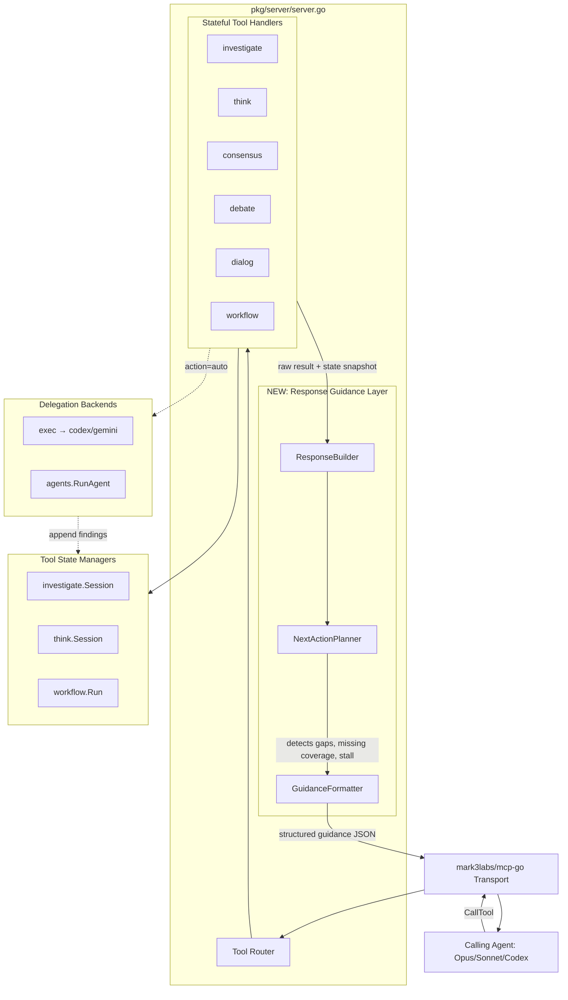

# Architecture: Tool Response Guidance Layer

**Date:** 2026-04-11
**Status:** Proposed
**Project:** aimux v3 (Go MCP server)
**Scope:** Refactor of stateful MCP tool response structure

---

## 1. Project Type & Detection

**Type:** MCP Server (Go, stdio transport via `mark3labs/mcp-go`).

**Signals observed:**
- `go.mod` with `github.com/mark3labs/mcp-go`
- `cmd/aimux/` stdio entry point
- `pkg/server/server.go` registers 13 tools + 13 skill prompts
- Tool handlers return `*mcp.CallToolResult` with structured content

**Subject of architecture:** The response shape and description metadata of stateful tools
(`investigate`, `think`, `consensus`, `debate`, `dialog`, `workflow`). One-shot tools
(`exec`, `status`, `sessions`, `audit`) are out of scope — they already communicate clearly
via exec results.

---

## 2. Problem Statement

### Observed failure

On 2026-04-10, an agent called `investigate(action="start", topic="...")` expecting the tool
to autonomously investigate. The tool returned `{session_id, iteration:0, findings_count:0}`
and the agent moved on, never posting findings. Session sat with zero content for hours.

### Root cause

MCP schemas enforce **syntax** (parameter types, enums) but not **workflow semantics**.
The `investigate` tool implements a state machine (`start → finding × N → assess → report`)
but:

1. The name "investigate" reads as an autonomous action verb
2. `start` returns a dashboard-style status, not an instruction
3. The multi-step flow is buried in the tool description text — LLMs under load skip it
4. No contextual next-step hint on any action response
5. No branching guidance (self-drive vs delegate to a sub-CLI)
6. No validation of end states (can `report` on an empty session)

### User requirement (verbatim, translated)

> The calling agent must clearly understand how to use a tool, and in which cases. Any such
> tool the agent must be able to invoke for its own reasoning, or hand off to a delegate.
> Do not rename. Rethink the invocation, the hints, make tools smart. aimux must **speak**
> to the agent, not just return success.

---

## 3. Architecture Diagram



**What's new:** The **Response Guidance Layer** sits between tool handlers and the MCP
transport. Every stateful tool response flows through it. Layer inputs: raw handler result
+ current session state. Layer output: an envelope containing result, current position,
next-action recommendation (self / delegate / hybrid), and explicit examples.

---

## 4. Component Map

| Component | Responsibility | Dependencies | Layer |
|-----------|---------------|--------------|-------|
| `ResponseBuilder` | Composes the final `CallToolResult` from handler output + guidance | Planner, Formatter | Interface Adapter |
| `NextActionPlanner` | Given state (session, iteration, convergence, gaps), computes the recommended next action(s) | Per-tool policies | Use Case |
| `GuidanceFormatter` | Renders the planner's decision into a structured JSON envelope with examples and "do_not" hints | none | Interface Adapter |
| `ToolPolicy` (interface) | Per-tool rules: when to recommend self vs delegate, how to detect stall, what coverage areas matter | — | Domain |
| `InvestigatePolicy` | Concrete policy: findings-count thresholds, coverage areas, convergence math | investigate state model | Domain |
| `ThinkPolicy` | For multi-step patterns (scientific_method, debugging_approach): next step number, required fields | think state model | Domain |
| `WorkflowPolicy` | Next stage, completion criteria, fallback on stage failure | workflow state model | Domain |
| `InvestigateAutoRunner` | New `action="auto"` handler — dispatches codex exec with a prompt that drives the full investigate state machine remotely | exec, session store | Use Case |
| `ToolDescription` (static config) | Rewritten tool descriptions: WHEN/WHY/HOW/CHOOSE sections instead of prose | — | Config |

---

## 5. Layer Boundaries

### Entry Layer (MCP transport)
Parses JSON-RPC, validates against JSONSchema. Not aware of workflow semantics.

### Tool Handler Layer (`pkg/server/server.go` handlers)
Validates business inputs, mutates session state, returns **raw result + state snapshot**.
Does NOT format the response envelope. This is the clean cut: handlers become dumber, the
guidance layer becomes smarter.

### Response Guidance Layer (NEW)
Consumes `(rawResult, stateSnapshot, toolName, action)`. Uses the tool's `ToolPolicy` to
compute:
- `you_are_here`: human-readable state description
- `choose_your_path`: named branches (`self`, `delegate`, `hybrid`) each with `when` /
  `next_call` / `example` / `then`
- `gaps` and `coverage` (when applicable)
- `do_not`: explicit anti-patterns the LLM should avoid
- `hint`: one-sentence reminder of what the tool does NOT do

### Domain Layer (per-tool policies)
Pure functions. `InvestigatePolicy.PlanNext(state) → NextActionPlan`. No IO, no MCP, no
HTTP. Fully unit-testable with fake state snapshots.

### Delegation Layer (`action="auto"`)
New execution path. Wraps `exec` tool with a prompt engineered to drive the target tool's
state machine from outside. Parses the sub-CLI's output into state mutations.

**Dependency rule:** MCP → Handlers → Guidance → Policies → State. Policies never import
from MCP or handlers. Handlers never format envelopes directly.

---

## 6. Data Flow

### Happy path — self-drive

```
1. Agent: investigate(action="start", topic="...")
2. MCP parses → Handler.handleStart(topic)
3. Handler creates session, returns (rawResult{session_id}, state{iteration:0, findings:0})
4. ResponseBuilder.Build(toolName="investigate", action="start", raw, state)
5. Planner.Plan(state) → NextActionPlan{
       recommended: "self",
       branches: [self, delegate, hybrid],
       gaps: all coverage areas,
       examples: populated per branch
   }
6. Formatter.Format(plan) → JSON envelope
7. MCP → Agent (agent reads envelope, sees clear instructions)

8. Agent: Read(source_doc) / Grep / codebase_search / think
9. Agent: investigate(action="finding", ..., confidence="VERIFIED")
10. Handler.handleFinding adds finding → state{iteration:1, findings:1}
11. ResponseBuilder → Planner → Formatter
12. Response says "1 finding so far, coverage: 1/5 areas, add more before assess"
13. ... loop ...
14. Agent: investigate(action="report")
15. Planner checks convergence/coverage → if below threshold, warns + offers force flag
16. Report generated, marked FINAL or PRELIMINARY
```

### Happy path — delegate

```
1. Agent: investigate(action="start", topic="...")
2. Response envelope arrives with choose_your_path.delegate example
3. Agent: investigate(action="auto", session_id=..., cli="codex", role="thinkdeep")
4. Handler.handleAuto:
   a. Build a prompt that embeds the topic + coverage areas + finding format contract
   b. Call exec tool with async=true, OnOutput callback parses codex JSON lines
   c. Each parsed line → session.AddFinding(...)
   d. Codex emits final {report: true} → trigger report action
5. Response envelope: "delegated to codex job_id=..., poll with status()"
6. Agent polls status(job_id) until done
7. Agent: investigate(action="report") → final report from auto-populated findings
```

### Happy path — hybrid

```
1. Agent self-drives 2-3 findings manually (gets a feel for shape)
2. Agent: investigate(action="auto", continue=true) → codex picks up where agent stopped
3. Final synthesis back in agent's hands
```

### Error paths

- **Handler fails** (IO, DB): raw error propagates, guidance layer wraps with "you_are_here:
  error — retry or skip this step" + recommended recovery call.
- **Planner detects stall** (session older than N minutes with no new findings): guidance
  envelope includes `alert: "session is stale"` and "auto_cleanup_in: Nm".
- **Agent calls action out of order** (e.g. `finding` without `start`): handler returns
  error, guidance layer transforms it into a constructive "call start first, then ..."
  message with example.
- **Agent calls `report` with zero findings**: no longer silently produces empty report.
  Handler returns guidance saying "cannot report with 0 findings, add at least 1 or call
  status=abandon".

---

## 7. Deployment Strategy

Same as current aimux — single Go binary (`aimux.exe`), stdio transport, spawned by mcp-mux
daemon. No new runtime dependencies.

**Build:** `go build ./cmd/aimux/` produces one binary, ~30 MB.

**Rollout:**
1. Behind no feature flag — response shape is backward-compatible (envelope fields are
   additive, the original fields stay in the same structure).
2. Deployed via existing release workflow (goreleaser on tag push).
3. mcp-mux auto-picks up new binary on next `mux_restart` — no config changes needed.

**Backward compatibility:** Old callers that only read `session_id` and ignore other fields
continue to work. New callers parse the envelope. **REVERSIBLE** — we can roll back the
response shape by reverting the guidance layer without touching handlers.

---

## 8. ADRs

### ADR-001: Introduce a Response Guidance Layer between handlers and transport
**Status:** Accepted
**Context:** Tool handlers currently build their own `CallToolResult` inline. Response shape
is inconsistent across tools and lacks guidance. We need a centralized place to attach
next-action hints.
**Decision:** Add a `ResponseBuilder` + `NextActionPlanner` + per-tool `ToolPolicy` between
handlers and the MCP transport. Handlers return raw result + state snapshot; the guidance
layer composes the final envelope.
**Consequences:**
- Handlers become thinner and more testable.
- Policies are pure functions — unit tests cover all branch decisions.
- All stateful tools get consistent envelope shape for free.
- Adds one indirection — tool call goes through two function calls instead of one.
**Reversibility:** REVERSIBLE (can revert to inline formatting per-tool).

### ADR-002: Envelope shape — structured JSON, not prose
**Status:** Accepted
**Context:** LLMs can parse both free prose and structured JSON. Free prose is friendlier
but inconsistent; structured JSON is easier for LLMs to extract `next_call` values from.
**Decision:** Response envelope is a JSON object with fields `state`, `you_are_here`,
`how_this_tool_works`, `choose_your_path` (with named branches each containing `when`,
`next_call`, `example`, `then`), `gaps`, `stop_conditions`, `do_not`. Each field is
independently optional — tools without branches omit `choose_your_path`.
**Consequences:**
- LLMs get deterministic parsing targets.
- Human-readable if printed verbatim (Claude Code renders JSON OK).
- A tool description schema change (one-time cost).
**Reversibility:** REVERSIBLE — can be renamed or flattened later.

### ADR-003: Add `action="auto"` as a first-class delegation mode
**Status:** Accepted
**Context:** Currently `investigate` has no delegation path. Agents that don't want to drive
the state machine themselves have no choice but to call `exec` separately and then
manually feed results back into `investigate` — which nobody does. Result: delegation
path is de-facto unavailable.
**Decision:** Add `action="auto"` to investigate, think, consensus, debate, workflow. Each
`auto` implementation wraps `exec` with a prompt that drives the target state machine.
Output lines are parsed into session state mutations. `auto` returns a `job_id` the agent
polls via `status`.
**Consequences:**
- Delegation becomes discoverable (it's in the same tool).
- Per-tool auto prompt engineering is non-trivial and must be maintained as tools evolve.
- Auto mode can run long — must respect aimux's async job lifecycle + cancel semantics.
**Reversibility:** PARTIALLY REVERSIBLE — removing `auto` later breaks callers that depend
on it, but the state model stays intact.

### ADR-004: Rewrite tool descriptions into WHEN/WHY/HOW/CHOOSE sections
**Status:** Accepted
**Context:** Current descriptions are dense prose that LLMs under load skim. Key semantic
info (workflow shape, tool-does-not-investigate-itself) is buried.
**Decision:** New description schema: a short one-line WHAT at the top, then explicit
sections WHEN (triggers), WHY (what problem it solves), HOW (step-by-step flow), CHOOSE
(self vs delegate decision). Descriptions become part of tool policy and live next to the
handler, not in server.go inline strings.
**Consequences:**
- LLMs get structured priors at registration time, not just at response time.
- Description gets longer — MCP schemas can hold several KB per tool, not a concern.
- Centralized descriptions make updates less error-prone.
**Reversibility:** REVERSIBLE — pure text change.

### ADR-005: Per-tool policies as pure functions, not classes
**Status:** Accepted
**Context:** Go doesn't have classes; the alternative is an interface with multiple structs
or top-level functions.
**Decision:** `ToolPolicy` is a Go interface with methods `PlanNext(state) NextActionPlan`,
`DetectStall(state) bool`, `CoverageAreas() []string`. Each tool has one concrete policy
struct. All methods are pure (no IO, no goroutines, no globals).
**Consequences:**
- Unit tests use fake state snapshots, no mocking needed.
- Policy changes are small diffs.
- No cross-tool coupling.
**Reversibility:** REVERSIBLE.

### ADR-006: Handler-to-guidance contract — return `(raw, state, error)`
**Status:** Accepted
**Context:** Current handlers return `*mcp.CallToolResult` directly. To insert a guidance
layer cleanly we need a new return type.
**Decision:** Internal handlers have signature
`(ctx, args) → (HandlerResult, error)` where `HandlerResult = struct{ Raw any; State any }`.
A thin adapter in `server.go` wraps this, calls the guidance layer, and produces the final
`CallToolResult`. External tool registration still uses the old
`func(ctx, *mcp.CallToolRequest) (*mcp.CallToolResult, error)` signature — the adapter
bridges both.
**Consequences:**
- One-time signature change for 6 handlers.
- Testability improves — handlers are testable without MCP plumbing.
- Guidance insertion is centralized in the adapter.
**Reversibility:** REVERSIBLE with moderate effort (signature changes propagate).

### ADR-007: Ship incrementally — start with `investigate`, then `think`, then the rest
**Status:** Accepted
**Context:** Rewriting 6 tools at once is high risk and blocks other work.
**Decision:** Phase 1: guidance layer infrastructure + `investigate` policy + description
rewrite. Phase 2: `think` (most-used). Phase 3: `consensus`, `debate`, `dialog`, `workflow`.
Each phase is a separate PR with its own tests.
**Consequences:**
- Slower end-to-end rollout.
- Early feedback from phase 1 informs phases 2-3.
- No big-bang deploy risk.
**Reversibility:** REVERSIBLE per phase.

---

## 9. Patterns Applied

- **Clean Architecture dependency rule:** guidance layer depends on policies, policies are
  pure domain. Handlers depend on guidance layer. Nothing in the policy layer imports MCP.
- **Policy object pattern:** per-tool behavior lives in a dedicated struct implementing
  `ToolPolicy`. Avoids giant switch statements.
- **Envelope over direct content:** response has a stable outer shape, tool-specific fields
  go in a nested `result` field. Makes client-side parsing uniform.
- **Instruction-as-data:** `next_call` is a string the LLM can almost paste verbatim, not a
  prose description of what to do next.
- **Explicit non-goals:** `hint` and `do_not` fields tell the LLM what the tool does NOT do,
  pre-empting the "autonomous investigation" misinterpretation.

---

## 10. Open Questions

1. **Should `auto` responses stream progress?** If a `investigate(action="auto")` job runs
   for 5 minutes, the agent polling `status(job_id)` wants to see findings accumulating.
   Depends on Issue #8 fix landing first (OnOutput wiring for agent async path). Decision:
   **blocked on #8**, implement `auto` in sync mode first, add streaming after #8 lands.

2. **Per-tool auto prompt location.** Prompts live in code (easy to edit, requires rebuild)
   or in `config/skills.d/` (hot-reloadable, but adds a config dependency). Decision:
   start in code, promote to skills.d only if authors iterate heavily.

3. **Guidance overhead.** Every stateful call now goes through Planner + Formatter. For hot
   tools (`think`) this adds maybe 50-200 μs per call. Measure before worrying.

4. **Description schema standardization.** Should other projects (mcp-mux, engram) adopt
   the same WHEN/WHY/HOW/CHOOSE schema? Out of scope for this arch doc — revisit after
   phase 1.

---

## 11. Handoff

Next step: `/nvmd-platform:nvmd-specify` to turn this architecture into a feature spec
(`.agent/specs/tool-response-guidance/spec.md`) with user stories, acceptance criteria, and
open questions resolved.

After the spec, phase 1 implementation goes through the standard flow: clarify → plan →
tasks → implement → PR → review → merge → release.
