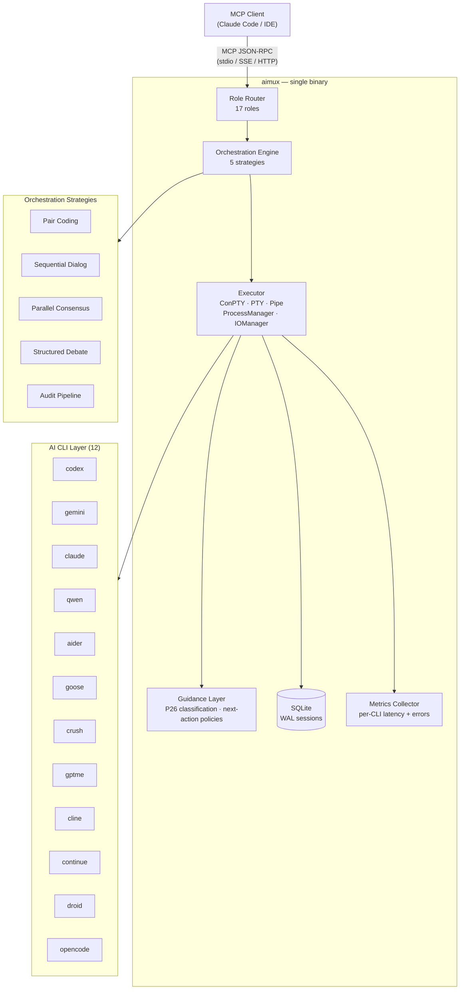

🌐 [English](README.md) | [Русский](README.ru.md)

[](https://go.dev)
[](LICENSE)
[](test/)
[](https://goreportcard.com/report/github.com/thebtf/aimux)
[](https://modelcontextprotocol.io)
[](config/cli.d/)

# aimux

**One MCP server. 12 AI coding CLIs. Zero context switching.**

---

## The Problem

You have Codex for generation, Claude for reasoning, Gemini for analysis, Aider for inline edits. Each lives in a separate terminal with its own flags, output format, and session state. Switching between them means copying prompts, losing context, and managing a dozen processes manually.

## The Solution

aimux is a single MCP server binary that exposes all 12 CLIs as one unified interface. Your editor makes one JSON-RPC call. aimux routes it to the right tool, orchestrates multi-model pipelines, normalizes output, and persists sessions in SQLite — all through the stdio transport every MCP client already speaks.

## Why Better

One binary, zero runtime dependencies, 857 tests, 3 transports. Role-based routing sends `codereview` prompts to the model tuned for review, `debug` prompts to the model best at tracing, and `secaudit` prompts to the model trained on vulnerability patterns — without you specifying a CLI name. Five orchestration strategies let multiple models debate, audit, or pair-code together. Policy-driven response guidance tells the client what to do next after every tool call. The result ships as a static Go binary you build once and copy anywhere.

---

## Architecture



---

## Quick Start

**Step 1 — Install**

```bash
go install github.com/thebtf/aimux/cmd/aimux@latest
```

**Step 2 — Wire into Claude Code**

Add to `~/.claude.json` (or your MCP client config):

```json
{
  "mcpServers": {
    "aimux": {
      "command": "aimux",
      "args": []
    }
  }
}
```

**Step 3 — Verify**

```bash
echo '{"jsonrpc":"2.0","id":1,"method":"tools/list","params":{}}' | aimux
```

You should see all 13 tools in the response. aimux auto-detects which CLIs are installed on `$PATH` — only installed tools appear as active.

---

## Features

### Routing and Execution

- **Route by role, not by name** — 17 semantic roles (`coding`, `codereview`, `debug`, `secaudit`, `analyze`, `refactor`, `testgen`, `planner`, `thinkdeep`, ...) each map to the best CLI, model, and reasoning effort for the job
- **Execute any CLI directly** — bypass routing and call any of the 12 CLIs by name with full control over model, flags, and session
- **Run async, poll by ID** — fire long jobs in the background, poll `status` when ready, never block your editor
- **Persist sessions across restarts** — SQLite-backed session store with WAL recovery; resume a Codex session by ID
- **Circuit breaker per CLI** — 3 consecutive failures open the circuit; cooldown prevents cascade failures
- **Graceful shutdown** — running CLI processes are drained before termination; no orphaned subprocesses

### Orchestration Strategies

- **Pair coding** — driver CLI writes code, reviewer CLI critiques each round; configurable rounds and roles
- **Sequential dialog** — two CLIs alternate responses for up to N turns; useful for iterative refinement
- **Parallel consensus** — all participant CLIs receive the same prompt independently (blinded); optionally synthesized into one authoritative response
- **Structured debate** — one CLI argues pro, another con, for a fixed number of turns; optional synthesis produces a verdict
- **Audit pipeline** — parallel scanners produce findings, a validator cross-checks false positives, an investigator digs into confirmed issues; structured report output

### Reasoning and Investigation

- **23 think patterns** — chain-of-thought, tree-of-thought, devil's advocate, SWOT, pre-mortem, scientific method, first principles, and 16 more; run solo or in multi-model consensus
- **Convergent investigation** — iterative deep-dive with 5-level confidence scoring, convergence tracking, findings accumulation, and recall from prior runs; structured envelope output with `state`, `coverage_gaps`, `choose_your_path`, and `do_not` anti-patterns
- **Deep research** — delegates to Google Gemini API for multi-step grounded research with source attribution, response caching, and file attachments

### Guidance and Classification

- **P26 classification** — every MCP tool action classified as `sync_ok`, `async_mandatory`, or `unknown`; a coverage guard test enforces classification for all new tools
- **Policy-driven response guidance** — `pkg/guidance/` injects next-action guidance into tool responses; each tool policy defines what to do, what not to do, and branching paths based on result state
- **Structured tool descriptions** — stateful tools use `WHAT / WHEN / WHY / HOW / NOT / CHOOSE` sections instead of prose paragraphs, making client-side tool selection unambiguous

### Agents and Skills

- **Agent registry** — project and user-level agent discovery; invoke named agents directly through the `agents` tool
- **Skill engine** — embedded skill definitions with disk overlay; project-local skills override global defaults without modifying the binary

### Quality and Reliability

- **Before/after hooks** — run scripts or commands before and after every CLI execution with timeout protection
- **Turn validator** — catches empty output, rate-limit responses, and refusals before they reach the client
- **Quality gate** — per-participant retry, escalate, or halt logic keeps multi-turn orchestration from degrading
- **17 role prompts** — composable system prompts loaded from `config/prompts.d/` for each role
- **Async progress streaming** — `handleAgentRun` streams live output via `OnOutput` callback and `notifications/progress` events; long agent runs are observable in real time

### Observability

- **Per-CLI metrics** — request counts, latency percentiles, and error rates exposed via `aimux://metrics`
- **Health resource** — `aimux://health` returns server uptime, active jobs, and circuit breaker states
- **3 transports** — stdio (default, zero config), SSE, and StreamableHTTP for network-based clients

---

## Supported CLIs

| CLI | Binary | Prompt style | Output format | Notes |
|-----|--------|-------------|---------------|-------|
| codex | `codex` | positional | JSONL | Session resume, reasoning effort flags |
| gemini | `gemini` | `-p` flag | JSON | Deep research via Gemini API |
| claude | `claude` | positional / `-p` headless | JSON | |
| qwen | `qwen` | `-p` flag | JSON | |
| aider | `aider` | `--message` flag | text | Inline file editing |
| goose | `goose` | `-t` flag | JSON | `goose run` subcommand |
| crush | `crush` | positional | text | `crush run` subcommand |
| gptme | `gptme` | positional | text | |
| cline | `cline` | positional | text | `cline task` subcommand |
| continue | `cn` | positional / `-p` headless | JSON | |
| droid | `droid` | positional | JSON | `droid exec` subcommand |
| opencode | `opencode` | positional | JSON | `opencode run` subcommand |

aimux auto-detects installed CLIs at startup via binary probing. Uninstalled CLIs are skipped — the server starts with whatever is available.

---

## MCP Tools Reference

| Tool | What it does | Key parameters |
|------|-------------|----------------|
| `exec` | Execute a prompt via any CLI with role-based routing | `prompt`, `cli`, `role`, `model`, `async`, `session_id` |
| `status` | Check async job status and retrieve output | `job_id` |
| `sessions` | Manage session lifecycle: list, info, cancel, kill, gc, health | `action`, `session_id` |
| `consensus` | Parallel blinded opinions from multiple CLIs with optional synthesis | `prompt`, `clis`, `blinded`, `synthesize` |
| `dialog` | Sequential multi-turn discussion between two CLIs | `prompt`, `cli_a`, `cli_b`, `max_turns` |
| `debate` | Adversarial structured debate with verdict | `topic`, `pro_cli`, `con_cli`, `synthesize` |
| `audit` | Multi-agent codebase audit: scan → validate → investigate | `path`, `mode`, `focus` |
| `deepresearch` | Deep research via Google Gemini with file attachments and caching | `topic`, `output_format`, `model`, `force` |
| `think` | 23 structured reasoning patterns, solo or multi-model | `prompt`, `pattern`, `clis`, `consensus` |
| `investigate` | Deep investigation with convergence tracking and recall | `question`, `domain`, `max_iterations` |
| `agents` | Discover and invoke project agents from registry | `action`, `agent_id`, `prompt` |
| `background` | Submit long-running tasks with role routing and progress streaming | `prompt`, `role`, `cli` |
| `workflow` | Declarative multi-step pipeline execution | `steps`, `context` |

### MCP Resources

| URI | Content |
|-----|---------|
| `aimux://health` | Server health, active jobs, circuit breaker states |
| `aimux://metrics` | Per-CLI request counts, latency, error rates |

### MCP Prompts / Skills

| Prompt | Use |
|--------|-----|
| `debug` | 5-phase debug: reproduce → investigate → root-cause → fix → verify |
| `review` | Code review with CLI-adaptive consensus/peer_review fallback |
| `audit` | Codebase audit with P0-P3 triage routing |
| `security` | 10-category security checklist with investigate integration |
| `research` | 4-phase pipeline: literature → comparison → adversarial → synthesis |
| `consensus` | Multi-model consensus with "consensus ≠ correctness" warning |
| `investigate` | Investigation protocol with domain auto-detect and convergence |
| `delegate` | Delegation decision tree: task size → routing (direct/exec/agent) |
| `tdd` | TDD workflow: RED gate → GREEN gate → IMPROVE → coverage |
| `workflow` | Declarative multi-step pipeline builder |
| `agent-exec` | Agent-first execution: match task → agent, exec as fallback |
| `guide` | Complete reference: tools, roles, patterns |
| `background` | Background async execution with role routing |

---

## Usage Examples

### Route by role (recommended)

```json
{
  "method": "tools/call",
  "params": {
    "name": "exec",
    "arguments": {
      "prompt": "Refactor this function to use early returns",
      "role": "refactor"
    }
  }
}
```

aimux resolves `refactor` to the configured CLI and model — no need to name a CLI explicitly.

### Fire async, poll later

```json
{
  "method": "tools/call",
  "params": {
    "name": "exec",
    "arguments": {
      "prompt": "Audit all authentication code for OWASP Top 10 issues",
      "role": "secaudit",
      "async": true
    }
  }
}
```

```json
{
  "method": "tools/call",
  "params": {
    "name": "status",
    "arguments": { "job_id": "job_01HXYZ..." }
  }
}
```

### Multi-model consensus

```json
{
  "method": "tools/call",
  "params": {
    "name": "consensus",
    "arguments": {
      "prompt": "What is the best approach for distributed rate limiting?",
      "clis": ["codex", "gemini", "claude"],
      "blinded": true,
      "synthesize": true
    }
  }
}
```

### Adversarial debate

```json
{
  "method": "tools/call",
  "params": {
    "name": "debate",
    "arguments": {
      "topic": "Should this service use event sourcing or CRUD?",
      "pro_cli": "codex",
      "con_cli": "gemini",
      "synthesize": true
    }
  }
}
```

### Structured reasoning

```json
{
  "method": "tools/call",
  "params": {
    "name": "think",
    "arguments": {
      "prompt": "Should we migrate this monolith to microservices?",
      "pattern": "premortem",
      "clis": ["codex", "gemini"],
      "consensus": true
    }
  }
}
```

---

## Configuration

### Server config (`config/default.yaml`)

aimux looks for config in `AIMUX_CONFIG_DIR` (env var) or `./config/` adjacent to the binary. Per-project overrides go in `{cwd}/.aimux/config.yaml`.

```yaml
server:
  log_level: info                      # debug | info | warn | error
  log_file: ~/.config/aimux/aimux.log
  db_path: ~/.config/aimux/sessions.db
  max_concurrent_jobs: 10
  session_ttl_hours: 24
  default_timeout_seconds: 300

  transport:
    type: stdio                        # stdio | sse | http
    port: :8080                        # used by sse and http transports
```

### Role routing (`config/default.yaml`)

```yaml
roles:
  coding:
    cli: codex
    model: gpt-5.4
  codereview:
    cli: codex
    model: gpt-5.4
    reasoning_effort: high
  analyze:
    cli: gemini
  thinkdeep:
    cli: codex
    model: gpt-5.4
    reasoning_effort: high
  default:
    cli: codex
```

Override any role at runtime with colon-delimited format `CLI:MODEL:EFFORT`:

```bash
AIMUX_ROLE_CODING=gemini:gemini-2.5-pro:high aimux
```

### CLI profiles (`config/cli.d/{name}/profile.yaml`)

Each CLI is described by a profile that tells aimux exactly how to invoke it:

```yaml
name: codex
binary: codex
command:
  base: "codex exec"
prompt_flag_type: positional
output_format: jsonl
stdin_threshold: 6000          # pipe via stdin above this char count
completion_pattern: "turn\\.completed"
headless_flags: ["--full-auto"]
```

### Circuit breaker

```yaml
circuit_breaker:
  failure_threshold: 3         # consecutive failures before opening
  cooldown_seconds: 300
  half_open_max_calls: 1
```

### Transport selection

```bash
# SSE transport (network clients)
MCP_TRANSPORT=sse PORT=:8080 aimux

# StreamableHTTP transport
MCP_TRANSPORT=http PORT=:8080 aimux
```

Both network transports bind to localhost by default.

---

## Installation

### Prerequisites

- Go 1.25+ — `go version`
- At least one supported CLI installed on `$PATH` (e.g. `codex`, `claude`, `gemini`)

### go install (recommended)

```bash
go install github.com/thebtf/aimux/cmd/aimux@latest
```

### Build from source

```bash
git clone https://github.com/thebtf/aimux.git
cd aimux
go build -o aimux ./cmd/aimux/
# Move the binary anywhere on $PATH
```

### Docker

```bash
# Build
docker build -t aimux .

# Run with stdio transport (pipe through docker)
docker run -i aimux

# Run with SSE transport
docker run -p 8080:8080 -e MCP_TRANSPORT=sse aimux
```

The Docker image copies `config/` to `/etc/aimux/config` automatically.

### Verify installation

```bash
echo '{"jsonrpc":"2.0","id":1,"method":"resources/list","params":{}}' | aimux
# Expected: { "result": { "resources": [{ "uri": "aimux://health", ... }] } }
```

### Releases

Pre-built binaries for Linux, macOS, and Windows are published for each tagged release via GoReleaser. Download from the [releases page](https://github.com/thebtf/aimux/releases) or install via `go install` above.

Available releases: `v3.0.0`, `v3.1.0`, `v3.2.0`.

---

## Development

```bash
# Build everything
go build ./...

# Run all 857 tests (~75s on Windows)
go test ./... -timeout 300s

# Unit tests with coverage
go test ./pkg/... -cover

# E2E tests only (real MCP protocol over stdio)
go test ./test/e2e/ -v

# Static analysis
go vet ./...
```

### CI

| Workflow | Trigger | What it does |
|----------|---------|--------------|
| `ci.yml` | push / PR | `go test -race`, `go vet`, `golangci-lint` on ubuntu / windows / macos |
| `mutation.yml` | weekly | gremlins mutation testing, 75% threshold |
| `release.yml` | tag push | GoReleaser cross-platform binaries |

### Project layout

```
cmd/aimux/           entry point — transport selection and server startup
cmd/testcli/         10 CLI emulators used by the e2e test suite
pkg/server/          MCP handlers for all 13 tools, resources, and prompts
pkg/orchestrator/    5 strategies + context management + quality gate
pkg/executor/        ConPTY / PTY / Pipe process executors
pkg/think/           23 reasoning patterns
pkg/investigate/     convergent investigation system
pkg/guidance/        policy registry, response builder, and tool guidance policies
pkg/guidance/policies/  per-tool guidance policies (investigate, exec, ...)
pkg/agents/          agent registry with project and user-level discovery
pkg/skills/          embedded skill engine with disk overlay
pkg/hooks/           before/after execution hooks with timeout protection
pkg/metrics/         thread-safe per-CLI metrics collector
pkg/session/         SQLite persistence with WAL and GC
pkg/config/          YAML config loader + CLI profiles
pkg/driver/          CLI binary detection and registry
pkg/resolve/         profile-aware command resolution
pkg/routing/         role-based CLI routing
pkg/prompt/          prompt engine with overlay and recursive directory loading
pkg/parser/          JSONL / JSON / text output normalizer
pkg/tools/deepresearch/  Gemini deep research with caching and file attachments
config/cli.d/        one profile.yaml per CLI
config/prompts.d/    composable role prompt templates
config/p26/          P26 tool classification artifact
```

### Stats

- **857 tests** across 117 test files, 0 failures
- **31 E2E tests** — real MCP protocol over stdio subprocess
- **27 packages**, ~73% weighted coverage

---

## Contributing

See [CONTRIBUTING.md](CONTRIBUTING.md) for the contribution guide, code style, and PR checklist.

---

## License

MIT — see [LICENSE](LICENSE).
