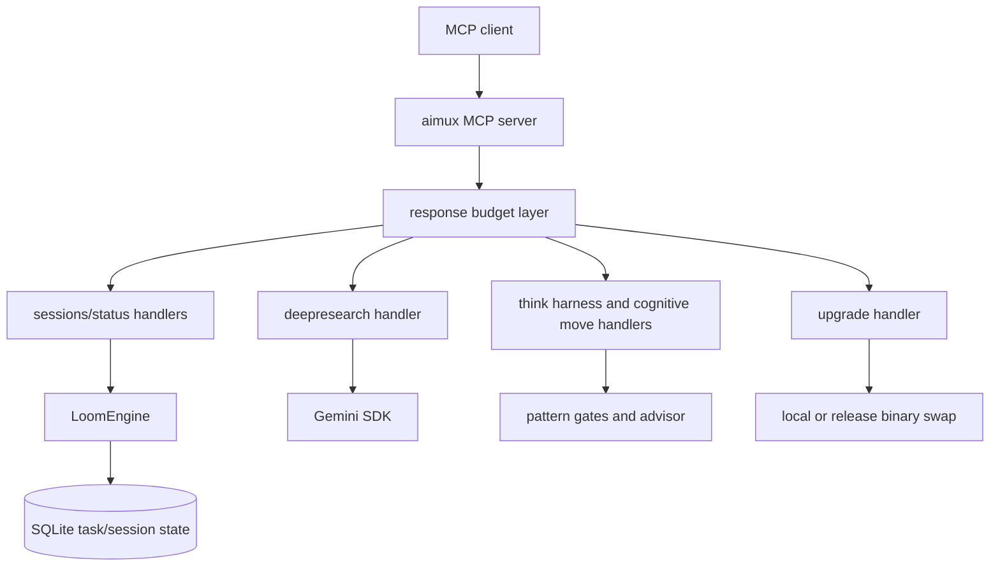

[English](README.md) | [Русский](README.ru.md)

# aimux

[](https://go.dev)
[](LICENSE)
[](https://modelcontextprotocol.io)

aimux is an MCP server for durable task state, session operations, deep
research, binary upgrades, and caller-centered structured reasoning.

The current post-purge live surface is intentionally small:

- 4 server tools: `status`, `sessions`, `deepresearch`, `upgrade`
- 1 caller-centered `think` harness plus 22 cognitive move tools

The former CLI-launching MCP tools (`exec`, `agent`, `agents`, `critique`,
`investigate`, `consensus`, `debate`, `dialog`, `audit`, `workflow`) were
removed from the live surface. Their pre-purge architecture is frozen at
`snapshot/v5.0.3-pre-cli-purge` and documented in
[docs/architecture/cli-tools-current.md](docs/architecture/cli-tools-current.md).
The next Layer 5 surface is tracked separately by AIMUX-9 / DEF-1.

## Quick Start

### Build

```powershell
$env:GOTOOLCHAIN = "go1.25.9"
go build -o aimux.exe ./cmd/aimux/
.\aimux.exe --version
```

Use Go 1.25.9 or newer for production builds.

### Configure An MCP Client

Add the binary to your MCP client configuration:

```json
{
  "mcpServers": {
    "aimux": {
      "command": "D:/Dev/aimux/aimux.exe",
      "args": []
    }
  }
}
```

### Verify The Tool Surface

Run `tools/list` from any MCP-capable client. A current build should expose
27 tools: the 4 server tools, the `think` harness, and 22 cognitive move tools.

```json
{
  "jsonrpc": "2.0",
  "id": 1,
  "method": "tools/list",
  "params": {}
}
```

## Commands

Common development and release checks:

```powershell
$env:GOTOOLCHAIN = "go1.25.9"
go build ./...
go test ./... -count=1 -timeout 300s
go test -tags=critical ./tests/critical/... -count=1 -timeout 300s
go vet ./...
go mod verify
govulncheck ./...

Set-Location loom
go test ./... -count=1
```

Use [docs/PRODUCTION-TESTING-PLAYBOOK.md](docs/PRODUCTION-TESTING-PLAYBOOK.md)
for customer-mode release walkthroughs.

## MCP Tool Reference

### Server Tools

| Tool | Purpose |
|---|---|
| `status` | Query async job/task status. |
| `sessions` | List, inspect, cancel, kill, garbage-collect, and health-check session/task state. |
| `deepresearch` | Run Gemini-backed research with structured output. |
| `upgrade` | Check or apply aimux binary updates, including local source installs with truthful deferred fallback. |

### Think Harness

`think(action=start|step|finalize)` is the canonical caller-centered thinking
harness. The caller owns the final answer; aimux tracks visible work products,
evidence, gate status, confidence ceilings, unresolved objections, budget state,
and a bounded `trace_summary`.

Typical flow:

1. `think(action=start, task=..., context_summary=...)` creates a session and
   returns allowed cognitive moves plus a first prompt.
2. `think(action=step, session_id=..., chosen_move=..., work_product=...,
   evidence=[...], confidence=...)` records a visible move result and returns
   gate/confidence feedback.
3. `think(action=finalize, session_id=..., proposed_answer=...)` accepts only
   when the loop, evidence, confidence, objections, and budget gates support it.

Legacy `think(thought=...)` calls fail closed with a migration error. They do
not route by keywords, create implicit sessions, or return pattern suggestion
fields.

### Cognitive Move Tools

The 22 cognitive move tools provide in-process structured reasoning moves. They
do not spawn AI CLIs.

| Tool | Use |
|---|---|
| `architecture_analysis` | Architecture tradeoffs and system structure. |
| `collaborative_reasoning` | Multi-perspective synthesis. |
| `critical_thinking` | Adversarial plan or claim review. |
| `debugging_approach` | Debug hypothesis planning. |
| `decision_framework` | Tradeoff analysis and decision records. |
| `domain_modeling` | Domain concepts, boundaries, and language. |
| `experimental_loop` | Iterate experiments and observations. |
| `literature_review` | Compare sources and findings. |
| `mental_model` | Explain or build conceptual models. |
| `metacognitive_monitoring` | Check reasoning quality and confidence. |
| `peer_review` | Review an artifact from a reviewer perspective. |
| `problem_decomposition` | Break complex work into tractable parts. |
| `recursive_thinking` | Revisit conclusions across levels. |
| `replication_analysis` | Assess reproducibility and missing evidence. |
| `research_synthesis` | Combine research evidence into conclusions. |
| `scientific_method` | Hypothesis, experiment, observation, conclusion. |
| `sequential_thinking` | Ordered step-by-step reasoning. |
| `source_comparison` | Compare claims across sources. |
| `stochastic_algorithm` | Explore randomized or probabilistic approaches. |
| `structured_argumentation` | Claims, evidence, objections, and rebuttals. |
| `temporal_thinking` | Timeline, sequencing, and time-based effects. |
| `visual_reasoning` | Spatial or visual structure reasoning. |

Each per-pattern result includes gate status and an advisor recommendation.
Stateless calls return `gate_status: "complete"`; stateful pattern sessions can
request additional steps when the gate finds missing evidence or insufficient
reasoning depth.

## Architecture Overview



### Loom Is Canonical Runtime State

Loom is the canonical runtime job/task state backend. The legacy JobManager
runtime backend has been removed. Public session/status responses read from
Loom-managed task state and legacy session metadata where needed for migration
visibility.

The Loom engine is also a standalone nested Go module:

- Module path: `github.com/thebtf/aimux/loom`
- Consumer guide: [loom/USAGE.md](loom/USAGE.md)
- Contract: [loom/CONTRACT.md](loom/CONTRACT.md)
- Recovery guide: [loom/RECOVERY.md](loom/RECOVERY.md)

## Repository Layout

| Path | Purpose |
|---|---|
| `cmd/aimux/` | Server entry point and binary wiring. |
| `pkg/server/` | MCP tool registration, handlers, response budgeting, and transport wiring. |
| `pkg/think/` | Think pattern execution, gates, and advisor. |
| `pkg/tools/deepresearch/` | Gemini-backed deep research. |
| `pkg/upgrade/`, `pkg/updater/` | Binary update, local source install, and handoff/deferred coordination. |
| `pkg/session/` | Session metadata store. |
| `loom/` | Standalone durable task engine module. |
| `tests/critical/` | Release-blocking critical suite. |
| `docs/` | Public architecture and production testing documentation. |

## Current Scope And Roadmap

Current production surface:

- Session and task health/status operations.
- Deep research through Gemini SDK.
- Binary update with local source install and deferred fallback when live handoff is not supported.
- Caller-centered `think` harness and 22 local cognitive move tools.
- Loom-backed task state and recovery.

Out of current scope:

- Direct CLI execution over MCP.
- Agent registry execution over MCP.
- Multi-model orchestration tools over MCP.
- Pipeline v5 Layer 5 exposure.

Those removed surfaces are not runtime defects in the current build. They are
future design work under AIMUX-9 / DEF-1.

## Release Gates

Before a release:

1. Build with Go 1.25.9 or newer.
2. Run the full Go test suite.
3. Run the critical suite under `tests/critical/`.
4. Run `go vet`, `go mod verify`, and `govulncheck`.
5. Walk through [docs/PRODUCTION-TESTING-PLAYBOOK.md](docs/PRODUCTION-TESTING-PLAYBOOK.md)
   in customer mode.
6. Verify installed/running binary freshness with `upgrade(action="check")`.
7. Verify local-source install through an MCP client or `mcp-launcher -mode install`.

## License

MIT. See [LICENSE](LICENSE).
