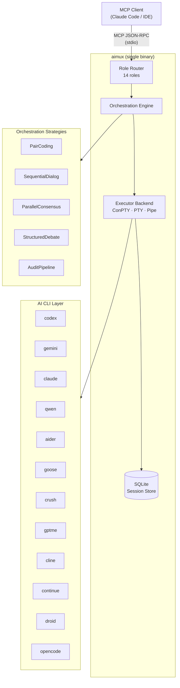

🌐 [English](README.md) | [Русский](README.ru.md)

[](https://github.com/thebtf/aimux/actions) [](https://github.com/thebtf/aimux/releases) [](https://go.dev) [](LICENSE) [](https://modelcontextprotocol.io) [](config/cli.d/)

# aimux

**One MCP server. Every AI coding CLI. Zero context switching.**

Modern AI-assisted development means juggling a dozen tools — Codex for generation, Claude for review, Gemini for analysis, Aider for inline edits. aimux is the MCP multiplexer that routes your prompts to the right tool automatically, orchestrates multi-model workflows, and persists sessions across restarts — all through a single stdio transport your editor already speaks. Stop managing CLIs. Start shipping.

## Architecture



## What's New in v3

- **Go rewrite** — single static binary, no Node runtime, no Python env, no npm. `go build` and ship.
- **Profile-aware command resolution** — every CLI has a `profile.yaml` defining its exact binary, flags, stdin threshold, and output format. No more hardcoded `-p prompt` hacks.
- **JSONL/JSON/text parser pipeline** — structured output from all 12 CLIs normalized into a consistent response envelope.
- **12 supported CLIs** — added Droid and OpenCode to the original 10.
- **306 tests, 62 e2e** — real MCP protocol round-trips over stdio; mutation testing via gremlins at 75% threshold.
- **ConPTY executor** — full PTY emulation on Windows without WSL for CLIs that require a terminal.

## Features

**Orchestrates multi-model workflows** — PairCoding, SequentialDialog, ParallelConsensus, StructuredDebate, and AuditPipeline strategies compose CLIs into pipelines that no single tool can match.

**Routes by role** — 14 semantic roles (`coding`, `codereview`, `thinkdeep`, `secaudit`, `debug`, `planner`, `analyze`, `refactor`, `testgen`, `docgen`, `tracer`, `precommit`, `challenge`, `default`) each map to the best CLI for the job, configurable in `default.yaml`.

**Persists sessions** — SQLite-backed session store survives restarts. Resume a Codex session by ID, cancel a runaway job, or GC stale sessions — all via the `sessions` tool.

**Executes asynchronously** — fire a long-running job, poll `status`, collect results when ready. Circuit breakers per CLI prevent cascade failures.

**Parses every output format** — JSONL (Codex), JSON (Claude, Gemini, Goose, Continue, Droid, OpenCode), and plain text (Aider, Crush, GPTMe, Cline) all normalized before returning to the client.

**Researches deeply** — `deepresearch` delegates to Google Gemini API for multi-step grounded research with source attribution.

**Thinks structurally** — `think` exposes 17 structured reasoning patterns (chain-of-thought, tree-of-thought, devil's advocate, SWOT, pre-mortem, etc.) runnable solo or in multi-model consensus.

**Discovers agents** — `agents` queries a registry of Loom Agents and can invoke them directly.

## Quick Start

**Step 1 — Build**

```bash
go build -o aimux ./cmd/aimux/
```

**Step 2 — Add to Claude Code**

```json
{
  "mcpServers": {
    "aimux": {
      "command": "/path/to/aimux",
      "args": [],
      "env": {}
    }
  }
}
```

**Step 3 — Verify**

```bash
echo '{"jsonrpc":"2.0","id":1,"method":"tools/list","params":{}}' | ./aimux
```

You should see all 11 tools listed in the response.

## Installation

### Prerequisites

- Go 1.25+ (`go version`)
- At least one supported AI CLI installed and on `$PATH` (e.g. `codex`, `claude`, `gemini`)

### From source (go install)

```bash
go install github.com/thebtf/aimux/cmd/aimux@latest
```

### Build from source

```bash
git clone https://github.com/thebtf/aimux.git
cd aimux
go build -o aimux ./cmd/aimux/
# Binary is at ./aimux — move it anywhere on $PATH
```

### Docker

```bash
# Build
docker build -t aimux .

# Run (stdio transport — pipe through docker)
docker run -i aimux
```

The Docker image copies `config/` to `/etc/aimux/config` and sets `AIMUX_CONFIG_DIR=/etc/aimux/config` automatically.

### Verification

```bash
echo '{"jsonrpc":"2.0","id":1,"method":"resources/list","params":{}}' | ./aimux
# Expected: { "result": { "resources": [{ "uri": "aimux://health", ... }] } }
```

## Configuration

### Server config (`config/default.yaml`)

The config file is located in `AIMUX_CONFIG_DIR` (env var) or `./config/` adjacent to the binary. Per-project overrides go in `{cwd}/.aimux/config.yaml`.

```yaml
server:
  log_level: info                    # debug | info | warn | error
  log_file: ~/.config/aimux/aimux.log
  db_path: ~/.config/aimux/sessions.db
  max_concurrent_jobs: 10            # global job concurrency cap
  session_ttl_hours: 24              # sessions older than this are GC'd
  gc_interval_seconds: 300           # how often GC runs
  progress_interval_seconds: 15      # async job heartbeat interval
  default_async: false               # run all jobs async by default
  default_timeout_seconds: 300       # per-job timeout

  audit:
    scanner_role: codereview
    validator_role: analyze
    default_mode: standard           # standard | deep | quick
    parallel_scanners: 3
    scanner_timeout_seconds: 600
    validator_timeout_seconds: 300

  pair:
    driver_role: coding
    reviewer_role: codereview
    max_rounds: 3
    driver_timeout_seconds: 300
    reviewer_timeout_seconds: 180

  consensus:
    default_blinded: true            # models don't see each other's answers
    default_synthesize: false        # emit synthesis pass after consensus
    max_turns: 8
    timeout_per_turn_seconds: 180

  debate:
    default_synthesize: true
    max_turns: 6
    timeout_per_turn_seconds: 180

  research:
    default_synthesize: true
    timeout_per_participant_seconds: 300

  think:
    auto_consensus_threshold: 60     # token count above which consensus is triggered
    default_dialog_max_turns: 4
```

### CLI Profiles (`config/cli.d/{name}/profile.yaml`)

Each CLI is described by a profile that tells aimux exactly how to invoke it:

```yaml
name: codex
binary: codex
display_name: "Codex (OpenAI)"

features:
  streaming: true
  headless: true
  read_only: true
  session_resume: true
  jsonl: true
  stdin_pipe: true

output_format: jsonl

command:
  base: "codex exec"

# How the prompt is passed:
#   positional — appended as last arg (codex, claude, crush, gptme, cline, continue, droid, opencode)
#   flag       — via a named flag (gemini: -p, aider: --message, goose: -t, qwen: -p)
prompt_flag: ""
prompt_flag_type: "positional"

model_flag: "-m"
default_model: ""

reasoning:
  flag: "-c"
  flag_value_template: 'model_reasoning_effort="{{.Level}}"'
  levels: [low, medium, high, xhigh]

timeout_seconds: 3600
stdin_threshold: 6000              # pipe via stdin above this char count
completion_pattern: "turn\\.completed"

headless_flags: ["--full-auto"]
read_only_flags: ["--sandbox", "read-only"]
```

### Role routing

Map each role to a CLI, model, and reasoning effort in `config/default.yaml`:

```yaml
roles:
  coding:
    cli: codex
    model: gpt-5.3-codex
  codereview:
    cli: codex
    model: gpt-5.4
    reasoning_effort: high
  analyze:
    cli: gemini
  thinkdeep:
    cli: codex
    model: gpt-5.4
    reasoning_effort: high
  default:
    cli: codex
```

Override any role at runtime via `AIMUX_ROLE_{ROLE}_CLI` and `AIMUX_ROLE_{ROLE}_MODEL` environment variables.

### Circuit breaker

```yaml
circuit_breaker:
  failure_threshold: 3        # consecutive failures before opening circuit
  cooldown_seconds: 300       # how long circuit stays open
  half_open_max_calls: 1      # probe calls in half-open state
```

## Supported CLIs

| Name | Binary | Command | Prompt flag | Output format |
|------|--------|---------|-------------|---------------|
| codex | `codex` | `codex exec` | positional | jsonl |
| gemini | `gemini` | `gemini` | `-p` | json |
| claude | `claude` | `claude` | positional (`-p` = headless) | json |
| qwen | `qwen` | `qwen` | `-p` | json |
| aider | `aider` | `aider` | `--message` | text |
| goose | `goose` | `goose run` | `-t` | json |
| crush | `crush` | `crush run` | positional | text |
| gptme | `gptme` | `gptme` | positional | text |
| cline | `cline` | `cline task` | positional | text |
| continue | `cn` | `cn` | positional (`-p` = headless) | json |
| droid | `droid` | `droid exec` | positional | json |
| opencode | `opencode` | `opencode run` | positional | json |

## MCP Tools Reference

| Tool | Description | Key parameters |
|------|-------------|----------------|
| `exec` | Execute a prompt via any CLI with role-based routing | `prompt`, `cli`, `role`, `model`, `async`, `session_id` |
| `status` | Check async job status and retrieve output | `job_id` |
| `sessions` | Manage sessions: list, info, cancel, kill, gc, health | `action`, `session_id` |
| `consensus` | Multi-model blinded consensus with optional synthesis | `prompt`, `clis`, `blinded`, `synthesize` |
| `dialog` | Sequential multi-turn dialog between two CLIs | `prompt`, `cli_a`, `cli_b`, `max_turns` |
| `debate` | Structured adversarial debate with verdict | `topic`, `pro_cli`, `con_cli`, `synthesize` |
| `audit` | Multi-agent codebase audit: scan → validate → investigate | `path`, `mode`, `focus` |
| `think` | 17 structured thinking patterns (solo or multi-model) | `prompt`, `pattern`, `clis`, `consensus` |
| `investigate` | Iterative convergent investigation with domain specialization | `question`, `domain`, `max_iterations` |
| `agents` | Discover and run Loom Agents from registry | `action`, `agent_id`, `prompt` |
| `deepresearch` | Deep research via Google Gemini API with source attribution | `query`, `depth`, `synthesize` |

## Usage Examples

### Execute a prompt via role routing

```json
{
  "jsonrpc": "2.0",
  "id": 1,
  "method": "tools/call",
  "params": {
    "name": "exec",
    "arguments": {
      "prompt": "Refactor this function to use early returns",
      "role": "refactor"
    }
  }
}
```

### Fire an async job and poll for results

```json
{
  "jsonrpc": "2.0",
  "id": 2,
  "method": "tools/call",
  "params": {
    "name": "exec",
    "arguments": {
      "prompt": "Audit all authentication code for OWASP Top 10 issues",
      "role": "secaudit",
      "async": true
    }
  }
}
```

```json
{
  "jsonrpc": "2.0",
  "id": 3,
  "method": "tools/call",
  "params": {
    "name": "status",
    "arguments": {
      "job_id": "job_01HXYZ..."
    }
  }
}
```

### Multi-model consensus

```json
{
  "jsonrpc": "2.0",
  "id": 4,
  "method": "tools/call",
  "params": {
    "name": "consensus",
    "arguments": {
      "prompt": "What is the best approach for distributed rate limiting?",
      "clis": ["codex", "gemini", "claude"],
      "blinded": true,
      "synthesize": true
    }
  }
}
```

### Structured debate

```json
{
  "jsonrpc": "2.0",
  "id": 5,
  "method": "tools/call",
  "params": {
    "name": "debate",
    "arguments": {
      "topic": "Should this service use event sourcing or CRUD?",
      "pro_cli": "codex",
      "con_cli": "gemini",
      "synthesize": true
    }
  }
}
```

## Orchestration Strategies

**PairCoding** — A driver CLI writes the implementation while a reviewer CLI critiques each round. Configurable rounds, driver/reviewer roles, and timeouts. Produces a diff-annotated final output.

**SequentialDialog** — Two CLIs take turns responding to each other's output for up to `max_turns` exchanges. Useful for iterative refinement where perspective alternation matters.

**ParallelConsensus** — All participant CLIs receive the same prompt independently (blinded by default). Their answers are compared and optionally synthesized by a coordinator into a single authoritative response.

**StructuredDebate** — One CLI argues the pro position, another argues con, for a fixed number of turns. A synthesis pass (optional) produces a verdict weighing both arguments.

**AuditPipeline** — Three-phase pipeline: parallel scanners (using `scanner_role`) produce findings, a validator (using `validator_role`) cross-checks for false positives, and an investigator digs into confirmed issues. Results are merged into a structured audit report.

## Development

```bash
# Build everything
go build ./...

# Run all tests (306 tests, ~75s on Windows)
go test ./... -timeout 300s

# Unit tests with coverage
go test ./pkg/... -cover

# E2E tests only (62 tests, real MCP protocol over stdio)
go test ./test/e2e/ -v

# PTY tests via WSL (Linux/Mac or WSL on Windows)
go test ./pkg/executor/ -v -tags pty

# Static analysis
go vet ./...

# Build testcli emulators (used by e2e suite)
go build -o testcli.exe ./cmd/testcli/
```

### Project layout

```
cmd/aimux/        — MCP server entry point (stdio transport)
cmd/testcli/      — 10 CLI emulators for e2e testing
pkg/server/       — MCP tool handlers (exec, status, sessions, dialog, etc.)
pkg/orchestrator/ — Multi-CLI strategies (consensus, debate, dialog, pair, audit)
pkg/executor/     — Process executors (ConPTY, PTY, Pipe)
pkg/driver/       — CLI profile loading and registry
pkg/config/       — YAML configuration
pkg/session/      — SQLite session/job persistence
pkg/parser/       — JSONL/JSON/text output parsers
pkg/types/        — Shared interfaces and types
config/cli.d/     — CLI profiles (one directory per CLI)
config/prompts.d/ — Composable prompt templates
```

### CI

- **ci.yml** — build + test on every push and PR
- **mutation.yml** — weekly mutation testing via gremlins, 75% kill threshold required

## Contributing

See [CONTRIBUTING.md](CONTRIBUTING.md) for the contribution guide, code style, and PR checklist.

## License

MIT — see [LICENSE](LICENSE).
