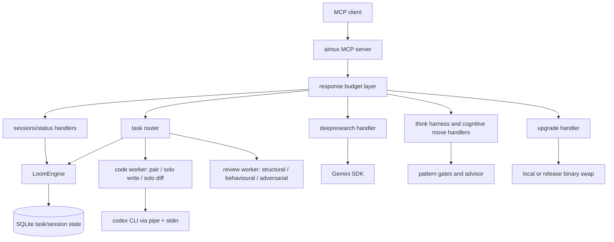

[English](README.md) | [Русский](README.ru.md)

# aimux

[](https://go.dev)
[](LICENSE)
[](https://modelcontextprotocol.io)

aimux is an MCP server for durable task state, session operations, deep
research, binary upgrades, and caller-centered structured reasoning.

The current post-purge live surface is intentionally small:

- 4 server tools: `status`, `sessions`, `deepresearch`, `upgrade`
- 2 methodology-bearing entry points: `task` for generic code/review/recipe work and `review` for direct review work
- 1 caller-centered `think` harness plus 22 cognitive move tools

The former CLI-launching MCP tools (`exec`, `agent`, `agents`, `critique`,
`investigate`, `consensus`, `debate`, `dialog`, `audit`, `workflow`) were
removed from the live surface. Their pre-purge architecture is frozen at
`snapshot/v5.0.3-pre-cli-purge` and documented in
[docs/architecture/cli-tools-current.md](docs/architecture/cli-tools-current.md).
The next Layer 5 surface is tracked separately by AIMUX-9 / DEF-1.

## Install

### From GitHub Release (recommended)

Download the latest release binary for your platform:

**Windows (PowerShell):**

```powershell
$version = "5.21.0"
gh release download "v$version" --repo thebtf/aimux --pattern "aimux_${version}_windows_amd64.zip" --output aimux.zip
Expand-Archive aimux.zip -DestinationPath "$env:LOCALAPPDATA\aimux" -Force
Remove-Item aimux.zip
# Add to PATH (current session):
$env:PATH = "$env:LOCALAPPDATA\aimux;$env:PATH"
aimux.exe --version
```

**Linux / macOS (bash):**

```bash
version="5.21.0"
os=$(uname -s | tr '[:upper:]' '[:lower:]')
arch=$(uname -m | sed 's/x86_64/amd64/;s/aarch64/arm64/')
gh release download "v${version}" --repo thebtf/aimux --pattern "aimux_${version}_${os}_${arch}.tar.gz" --output aimux.tar.gz
mkdir -p ~/.local/bin
tar xzf aimux.tar.gz -C ~/.local/bin aimux
rm aimux.tar.gz
chmod +x ~/.local/bin/aimux
aimux --version
```

### From Source

```powershell
$env:GOTOOLCHAIN = "go1.25.11"
go build -o aimux.exe ./cmd/aimux/
.\aimux.exe --version
```

Requires Go 1.25.11 or newer.

### Configure MCP Client

Add aimux to `.mcp.json` (Claude Code) or the equivalent config for your MCP
client:

```json
{
  "mcpServers": {
    "aimux": {
      "command": "aimux",
      "args": []
    }
  }
}
```

If the binary is not on PATH, use the full path:

```json
{
  "mcpServers": {
    "aimux": {
      "command": "C:/Users/you/AppData/Local/aimux/aimux.exe",
      "args": []
    }
  }
}
```

### Verify

Run `tools/list` from any MCP-capable client. A current build should expose
29 tools: the 4 server tools, the `task` and `review` entry points, the
`think` harness, and 22 cognitive move tools.

```json
{
  "jsonrpc": "2.0",
  "id": 1,
  "method": "tools/list",
  "params": {}
}
```

## Commands

Common development and release checks:

```powershell
$env:GOTOOLCHAIN = "go1.25.11"
go build ./...
go test ./... -count=1 -timeout 300s
go test ./tests/critical -count=1 -timeout 300s
$env:AIMUX21_E2E = "1"
go test ./test/e2e -run 'TestE2E_(AIMUX21|ReviewEntry|TaskRouter|Resume)' -count=1 -timeout 600s
go vet ./...
go mod verify
govulncheck ./...

Set-Location loom
go test ./... -count=1
```

Use [docs/PRODUCTION-TESTING-PLAYBOOK.md](docs/PRODUCTION-TESTING-PLAYBOOK.md)
for customer-mode release walkthroughs.

## MCP Tool Reference

### Server Tools

| Tool | Purpose |
|---|---|
| `status` | Query async job/task status. |
| `sessions` | List, inspect, cancel, kill, garbage-collect, and health-check session/task state. |
| `deepresearch` | Run Gemini-backed research with structured output. |
| `upgrade` | Check or apply aimux binary updates, including local source installs with truthful deferred fallback. |

### Task and Review Entry Points

| Tool | Purpose |
|---|---|
| `task` | Route code, review, and curated recipe work through the Loom-backed worker with 3 code execution modes. |
| `review` | Dedicated review facade over the same task/Loom backbone for standard and gate-oriented code review work. |

The `task` tool supports three code execution modes controlled by the `navigator`
parameter:

| Mode | navigator | sandbox | Behavior |
|---|---|---|---|
| **Pair** | CLI name (e.g. `"codex"`) | any | driver(read-only) → diff → navigator(review) → apply → gate |
| **Solo write** | `"none"` | `workspace-write` / `danger` | driver writes files directly → gate verifies |
| **Solo diff** | `"none"` | `read-only` | driver returns unified diff to caller |

Codex CLI always uses `--dangerously-bypass-approvals-and-sandbox
--skip-git-repo-check --json`. Prompt delivered via stdin controls mode behavior.
Codex-backed startup now derives a stable project-scoped `CODEX_HOME`, so auth,
config, and persistent state stay inside the virtual home instead of leaking
through the caller's ambient global Codex home.

### Task Inspection Resources

| Resource | Purpose |
|---|---|
| `aimux://tasks` | Bounded read-only task list with snapshot/viewer/events/progress links. |
| `aimux://tasks/{task_id}` | Compact Loom task snapshot with status, progress summary, and resource links. |
| `aimux://tasks/{task_id}/viewer` | Self-contained read-only HTML view of snapshot, metadata, events, and progress. |
| `aimux://tasks/{task_id}/events` | Bounded lifecycle, runtime, and terminal artifact page for one task. Supports `limit`, `cursor`, `kind`, `event_type`, and `channel` query filters; `kind` is bounded to `lifecycle`, `terminal`, and `runtime`. |
| `aimux://tasks/{task_id}/progress` | Bounded progress artifact page for compact polling consumers. Supports `limit`, `cursor`, and resource-local `kind=progress`. |

Use these resources when a caller needs task evidence without reading daemon
logs. Event and progress pages are cursor/limit paginated; `kind` filters are
resource-local, so cross-family requests return `invalid_kind` instead of data
from another surface. Event pages also support typed runtime slicing by artifact
kind, event type, and channel. Runtime
events are projection-only evidence: Loom task status, result, and lifecycle
ownership remain canonical in the task row. Less structured harness output is
preserved as truthful `raw`/`stdout` runtime evidence rather than hidden, while
structured harness frames can surface `text_delta`, `status`, `tool_call`, and
`tool_result` events. Secret-like values are redacted before artifact storage.
Large task results are summarized in the snapshot resource.
The HTML viewer is server-rendered from the same Loom/resource projection and
contains no forms, buttons, scripts, or task execution controls.

Mutating code flows also add worktree preservation metadata to the task result
and task snapshot metadata. Pair apply, write-review, and solo-write flows
include `worktree_path`, `worktree_branch`, `worktree_base_sha`, and
`worktree_preserve_reason` so callers can recover or review the touched
worktree. Read-only recipes and solo-diff flows stay non-mutating and do not
emit preservation metadata.

### Curated Recipe Resources

| Resource | Purpose |
|---|---|
| `aimux://recipes` | Compact compiled recipe catalog with IDs, descriptions, phases, policy needs, and output resource hints. |
| `aimux://recipes/{recipe_id}` | Detail view for one supported recipe. Unknown IDs return `not_found` plus `available_recipes`. |

Supported recipes are read-only and route through the existing `task` entry point:

| Recipe ID | Task class | Default mode | Purpose |
|---|---|---|---|
| `code-review` | `review` | gate | Run the existing review worker as a named code-review recipe. |
| `second-opinion` | `review` | aggregate | Run the existing review worker for an independent read-only assessment. |
| `security-audit` | `review` | aggregate | Run the compiled `pkg/workflow/secaudit.go` security audit workflow as a read-only recipe. |
| `debug-investigation` | `review` | aggregate | Run the compiled `pkg/workflow/debug.go` debugging workflow as a read-only recipe. |

Invoke a recipe through `task(recipe_id=..., target=...)`; no new workflow,
dialog, audit, consensus, debate, or recipe tool is added. The dedicated
`review` facade stays bounded to standard/gate-oriented review and the
`code-review` recipe; invoke every other recipe through `task`. Workflow-backed
recipes expose `recipe_workflow_id`, `recipe_workflow_source`, and
`recipe_workflow_steps` metadata while staying behind the `task` contract.
Recipe policy is fail-closed before worker spawn: if the
selected provider/profile cannot enforce the recipe's declared policy needs,
`task` returns a non-retryable `CapabilityMismatch` and no Loom task is
submitted.

Capability mismatch payloads include `recipe_id`, `selected_cli`,
`requested_policy`, `missing_capabilities`, and `supported_capabilities`.
Current enforced classes are read-only execution, structured JSON/JSONL output,
target-required recipe arguments, plus compiled gates for future sandbox,
approval, schema, max-turn, and version policies.

Read-only curated recipe invocations also carry deterministic replay metadata.
For matching completed runs, `task(recipe_id=...)` can return the completed
source task without submitting duplicate Loom work. The replay fingerprint uses
recipe ID, replay key version, prompt, target, CWD, task/worker class, selected
CLI, model/role/effort, and enforced policy fingerprints. Cache hits are
visible in the returned task metadata as `recipe_replay_cache_hit=true` with
`recipe_replay_source_task_id`; task resources expose the source task's
`recipe_replay_key_version`, `recipe_replay_fingerprint`, and
`recipe_replay_cache_hit=false` reusable-source marker. Failed, crashed,
cancelled, running, policy-mismatched, non-recipe, and changed-precondition
tasks are not replayed as success.

### Caller Guide Resources

| Resource | Purpose |
|---|---|
| `aimux://guides` | Compact catalog of compiled caller guides. |
| `aimux://guides/caller` | Markdown guide for `task`, `think`, task/recipe resources, replay metadata, viewer usage, and safety rules. |

Use the compiled caller guide as the supported source for task, think, recipe,
replay, viewer, and safety examples for the running binary.

### Think Harness

`think(action=start|step|finalize)` is the canonical caller-centered thinking
harness. The caller owns the final answer; aimux tracks visible work products,
evidence, gate status, confidence ceilings, unresolved objections, budget state,
and a bounded `trace_summary`.

Typical flow:

1. `think(action=start, task=..., context_summary=...)` creates a session and
   returns allowed cognitive moves plus a first prompt.
2. `think(action=step, session_id=..., chosen_move=..., work_product=...,
   evidence=[...], confidence=...)` records a visible move result and returns
   gate/confidence feedback.
3. `think(action=finalize, session_id=..., proposed_answer=...)` accepts only
   when the loop, evidence, confidence, objections, and budget gates support it.

Legacy `think(thought=...)` calls fail closed with a migration error. They do
not route by keywords, create implicit sessions, or return pattern suggestion
fields.

### Cognitive Move Tools

The 22 cognitive move tools provide in-process structured reasoning moves. They
do not spawn AI CLIs.

| Tool | Use |
|---|---|
| `architecture_analysis` | Architecture tradeoffs and system structure. |
| `collaborative_reasoning` | Multi-perspective synthesis. |
| `critical_thinking` | Adversarial plan or claim review. |
| `debugging_approach` | Debug hypothesis planning. |
| `decision_framework` | Tradeoff analysis and decision records. |
| `domain_modeling` | Domain concepts, boundaries, and language. |
| `experimental_loop` | Iterate experiments and observations. |
| `literature_review` | Compare sources and findings. |
| `mental_model` | Explain or build conceptual models. |
| `metacognitive_monitoring` | Check reasoning quality and confidence. |
| `peer_review` | Review an artifact from a reviewer perspective. |
| `problem_decomposition` | Break complex work into tractable parts. |
| `recursive_thinking` | Revisit conclusions across levels. |
| `replication_analysis` | Assess reproducibility and missing evidence. |
| `research_synthesis` | Combine research evidence into conclusions. |
| `scientific_method` | Hypothesis, experiment, observation, conclusion. |
| `sequential_thinking` | Ordered step-by-step reasoning. |
| `source_comparison` | Compare claims across sources. |
| `stochastic_algorithm` | Explore randomized or probabilistic approaches. |
| `structured_argumentation` | Claims, evidence, objections, and rebuttals. |
| `temporal_thinking` | Timeline, sequencing, and time-based effects. |
| `visual_reasoning` | Spatial or visual structure reasoning. |

Each per-pattern result includes gate status and an advisor recommendation.
Stateless calls return `gate_status: "complete"`; stateful pattern sessions can
request additional steps when the gate finds missing evidence or insufficient
reasoning depth.

## Architecture Overview


```mermaid
flowchart TD
    Client[MCP client] --> Server[aimux MCP server]
    Server --> Budget[response budget layer]
    Budget --> Sessions[sessions/status handlers]
    Budget --> Research[deepresearch handler]
    Budget --> Upgrade[upgrade handler]
    Budget --> Think[think harness and cognitive move handlers]
    Budget --> Task[task router]

    Sessions --> Loom[LoomEngine]
    Task --> Loom
    Task --> CodeWorker[code worker: pair / solo write / solo diff]
    Task --> ReviewWorker[review worker: structural / behavioural / adversarial]
    CodeWorker --> Codex[codex CLI via pipe + stdin]
    Loom --> SQLite[(SQLite task/session state)]
    Research --> Gemini[Gemini SDK]
    Think --> Gates[pattern gates and advisor]
    Upgrade --> Binary[local or release binary swap]
```

### Loom Is Canonical Runtime State

Loom is the canonical runtime job/task state backend. The legacy JobManager
runtime backend has been removed. Public session/status responses read from
Loom-managed task state and legacy session metadata where needed for migration
visibility.

The Loom engine is also a standalone nested Go module:

- Module path: `github.com/thebtf/aimux/loom`
- Consumer guide: [loom/USAGE.md](loom/USAGE.md)
- Contract: [loom/CONTRACT.md](loom/CONTRACT.md)
- Recovery guide: [loom/RECOVERY.md](loom/RECOVERY.md)

## Repository Layout

| Path | Purpose |
|---|---|
| `cmd/aimux/` | Server entry point and binary wiring. |
| `pkg/server/` | MCP tool registration, handlers, response budgeting, and transport wiring. |
| `pkg/think/` | Think pattern execution, gates, and advisor. |
| `pkg/tools/deepresearch/` | Gemini-backed deep research. |
| `pkg/executor/code/` | Code worker: pair rounds, solo modes, FSM, diff apply, gate. |
| `pkg/executor/review/` | Review worker: multi-pass structural/behavioural/adversarial pipeline. |
| `pkg/executor/fallback/` | Cross-CLI fallback engine with score-based re-ranking. |
| `pkg/upgrade/`, `pkg/updater/` | Binary update, local source install, and handoff/deferred coordination. |
| `pkg/session/` | Session metadata store. |
| `loom/` | Standalone durable task engine module. |
| `tests/critical/` | Release-blocking critical suite. |
| `docs/` | Public architecture and production testing documentation. |

## Current Scope And Roadmap

Current production surface:

- Session and task health/status operations.
- Deep research through Gemini SDK.
- Binary update with local source install and deferred fallback when live handoff is not supported.
- Caller-centered `think` harness and 22 local cognitive move tools.
- Loom-backed task state and recovery.
- Task entry point with 3 execution modes: pair (driver+navigator), solo write, solo diff.
- Dedicated `review` facade over the same task/runtime-events backbone.
- Task inspection resources under `aimux://tasks/{task_id}`.
- Compiled read-only recipe discovery under `aimux://recipes` and invocation via `task(recipe_id=...)`.
- Read-only task list/viewer resources for browser-readable inspection without execution controls.
- Compiled caller guide resources under `aimux://guides/caller`.

Out of current scope:

- Agent registry execution over MCP.
- Multi-model orchestration tools over MCP.
- Pipeline v5 Layer 5 exposure (beyond the task/review entry points).
- Mutation-heavy recipe expansion beyond the compiled read-only initial recipes.

Those removed surfaces are not runtime defects in the current build. They are
future design work under AIMUX-9 / DEF-1.

## Release Gates

Before a release:

1. Build with Go 1.25.11 or newer.
2. Run the full Go test suite.
3. Run the critical suite under `tests/critical/`.
4. Run `go vet`, `go mod verify`, and `govulncheck`.
5. Walk through [docs/PRODUCTION-TESTING-PLAYBOOK.md](docs/PRODUCTION-TESTING-PLAYBOOK.md)
   in customer mode.
6. Verify installed/running binary freshness with `upgrade(action="check")`.
7. Verify local-source install through an MCP client or `mcp-launcher -mode install`.

## License

MIT. See [LICENSE](LICENSE).
