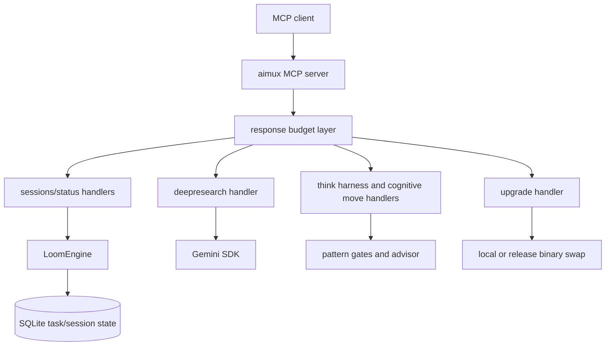

<!-- synced: 2026-05-13 source-commit: a667b0e -->
[English](README.md) | [Русский](README.ru.md)

# aimux

[](https://go.dev)
[](LICENSE)
[](https://modelcontextprotocol.io)

aimux — MCP-сервер для устойчивого состояния задач, операций с сессиями,
глубокого исследования, обновления бинарника и caller-centered structured
reasoning.

Текущая live surface после purge намеренно небольшая:

- 4 server tools: `status`, `sessions`, `deepresearch`, `upgrade`
- 1 `task` entry point for code/review workflows
- 1 caller-centered `think` harness и 22 cognitive move tools

Прежние CLI-launching MCP tools (`exec`, `agent`, `agents`, `critique`,
`investigate`, `consensus`, `debate`, `dialog`, `audit`, `workflow`) удалены из
live surface. Их pre-purge архитектура заморожена в ветке
`snapshot/v5.0.3-pre-cli-purge` и описана в
[docs/architecture/cli-tools-current.md](docs/architecture/cli-tools-current.md).
Следующая Layer 5 surface отслеживается отдельно в AIMUX-9 / DEF-1.

## Установка

### Из GitHub Release (рекомендуется)

Скачайте бинарник для вашей платформы:

**Windows (PowerShell):**

```powershell
$version = "5.12.0"
gh release download "v$version" --repo thebtf/aimux --pattern "aimux_${version}_windows_amd64.zip" --output aimux.zip
Expand-Archive aimux.zip -DestinationPath "$env:LOCALAPPDATA\aimux" -Force
Remove-Item aimux.zip
$env:PATH = "$env:LOCALAPPDATA\aimux;$env:PATH"
aimux.exe --version
```

**Linux / macOS (bash):**

```bash
version="5.12.0"
os=$(uname -s | tr '[:upper:]' '[:lower:]')
arch=$(uname -m | sed 's/x86_64/amd64/;s/aarch64/arm64/')
gh release download "v${version}" --repo thebtf/aimux --pattern "aimux_${version}_${os}_${arch}.tar.gz" --output aimux.tar.gz
mkdir -p ~/.local/bin
tar xzf aimux.tar.gz -C ~/.local/bin aimux
rm aimux.tar.gz
chmod +x ~/.local/bin/aimux
aimux --version
```

### Из исходников

```powershell
$env:GOTOOLCHAIN = "go1.25.10"
go build -o aimux.exe ./cmd/aimux/
.\aimux.exe --version
```

Требуется Go 1.25.10+.

### Настройка MCP-клиента

Добавьте aimux в `.mcp.json` (Claude Code) или аналогичный конфиг вашего MCP-клиента:

```json
{
  "mcpServers": {
    "aimux": {
      "command": "aimux",
      "args": []
    }
  }
}
```

Если бинарник не в PATH — укажите полный путь:

```json
{
  "mcpServers": {
    "aimux": {
      "command": "C:/Users/you/AppData/Local/aimux/aimux.exe",
      "args": []
    }
  }
}
```

### Проверка

Вызовите `tools/list` из любого MCP-клиента. Актуальная сборка должна
показать 28 tools: 4 server tools, `task`, `think` harness и 22 cognitive move tools.

```json
{
  "jsonrpc": "2.0",
  "id": 1,
  "method": "tools/list",
  "params": {}
}
```

## Команды

Обычные development и release checks:

```powershell
$env:GOTOOLCHAIN = "go1.25.10"
go build ./...
go test ./... -count=1 -timeout 300s
go test ./tests/critical -count=1 -timeout 300s
$env:AIMUX21_E2E = "1"
go test ./test/e2e -run 'TestE2E_(AIMUX21|CodeEntry|ReviewEntry|TaskRouter|Resume)' -count=1 -timeout 600s
go vet ./...
go mod verify
govulncheck ./...

Set-Location loom
go test ./... -count=1
```

Для customer-mode release walkthrough используйте
[docs/PRODUCTION-TESTING-PLAYBOOK.md](docs/PRODUCTION-TESTING-PLAYBOOK.md).

## MCP Tool Reference

### Server Tools

| Tool | Назначение |
|---|---|
| `status` | Запрос статуса async job/task. |
| `sessions` | Просмотр, инспекция, отмена, kill, garbage collection и health-check состояния сессий и задач. |
| `deepresearch` | Gemini-backed исследование со structured output. |
| `upgrade` | Проверка или применение обновлений aimux binary, включая local source install с честным deferred fallback. |

### Task Entry Point

| Tool | Назначение |
|---|---|
| `task` | Loom-backed entry point для code/review tasks с 3 режимами исполнения. |

`task` поддерживает три режима исполнения кода через параметр `navigator`:

| Режим | navigator | sandbox | Поведение |
|---|---|---|---|
| **Pair** | имя CLI (напр. `"codex"`) | любой | driver(read-only) → diff → navigator(review) → apply → gate |
| **Solo write** | `"none"` | `workspace-write` / `danger` | driver пишет файлы напрямую → gate проверяет |
| **Solo diff** | `"none"` | `read-only` | driver возвращает unified diff вызывающему агенту |

Codex CLI всегда использует `--dangerously-bypass-approvals-and-sandbox
--skip-git-repo-check --json`. Промпт через stdin определяет поведение.

### Think Harness

`think(action=start|step|finalize)` — canonical caller-centered thinking
harness. Caller владеет final answer; aimux отслеживает visible work products,
evidence, gate status, confidence ceilings, unresolved objections, budget state
и bounded `trace_summary`.

Типичный flow:

1. `think(action=start, task=..., context_summary=...)` создаёт session и
   возвращает allowed cognitive moves плюс первый prompt.
2. `think(action=step, session_id=..., chosen_move=..., work_product=...,
   evidence=[...], confidence=...)` записывает visible move result и возвращает
   gate/confidence feedback.
3. `think(action=finalize, session_id=..., proposed_answer=...)` принимает
   ответ только когда loop, evidence, confidence, objections и budget gates его
   поддерживают.

Legacy `think(thought=...)` calls fail closed с migration error. Они не делают
keyword routing, не создают implicit sessions и не возвращают pattern
suggestion fields.

### Cognitive Move Tools

22 cognitive move tools дают in-process structured reasoning moves. Они не
запускают AI CLIs.

| Tool | Использование |
|---|---|
| `architecture_analysis` | Архитектурные tradeoffs и структура системы. |
| `collaborative_reasoning` | Синтез нескольких перспектив. |
| `critical_thinking` | Adversarial review плана или утверждения. |
| `debugging_approach` | Планирование debug hypotheses. |
| `decision_framework` | Анализ tradeoffs и decision records. |
| `domain_modeling` | Domain concepts, boundaries и language. |
| `experimental_loop` | Итерация experiments и observations. |
| `literature_review` | Сравнение sources и findings. |
| `mental_model` | Объяснение или построение conceptual models. |
| `metacognitive_monitoring` | Проверка reasoning quality и confidence. |
| `peer_review` | Review artifact с позиции reviewer. |
| `problem_decomposition` | Разбиение сложной работы на tractable parts. |
| `recursive_thinking` | Повторная проверка выводов на нескольких уровнях. |
| `replication_analysis` | Оценка reproducibility и недостающих evidence. |
| `research_synthesis` | Объединение research evidence в выводы. |
| `scientific_method` | Hypothesis, experiment, observation, conclusion. |
| `sequential_thinking` | Последовательное step-by-step reasoning. |
| `source_comparison` | Сравнение claims across sources. |
| `stochastic_algorithm` | Разбор randomized или probabilistic approaches. |
| `structured_argumentation` | Claims, evidence, objections и rebuttals. |
| `temporal_thinking` | Timeline, sequencing и time-based effects. |
| `visual_reasoning` | Spatial или visual structure reasoning. |

Каждый per-pattern result включает gate status и advisor recommendation.
Stateless calls возвращают `gate_status: "complete"`; stateful pattern sessions
могут запросить дополнительные шаги, если gate видит missing evidence или
недостаточную глубину reasoning.

## Обзор архитектуры



### Loom — canonical runtime state

Loom — canonical runtime job/task state backend. Legacy JobManager runtime
backend удалён. Public session/status responses читают состояние задач из Loom
и legacy session metadata там, где это нужно для migration visibility.

Loom engine также является standalone nested Go module:

- Module path: `github.com/thebtf/aimux/loom`
- Consumer guide: [loom/USAGE.md](loom/USAGE.md)
- Contract: [loom/CONTRACT.md](loom/CONTRACT.md)
- Recovery guide: [loom/RECOVERY.md](loom/RECOVERY.md)

## Структура репозитория

| Path | Назначение |
|---|---|
| `cmd/aimux/` | Server entry point и binary wiring. |
| `pkg/server/` | MCP tool registration, handlers, response budgeting и transport wiring. |
| `pkg/think/` | Think pattern execution, gates и advisor. |
| `pkg/tools/deepresearch/` | Gemini-backed deep research. |
| `pkg/upgrade/`, `pkg/updater/` | Binary update, local source install и handoff/deferred coordination. |
| `pkg/session/` | Session metadata store. |
| `loom/` | Standalone durable task engine module. |
| `tests/critical/` | Release-blocking critical suite. |
| `docs/` | Public architecture и production testing documentation. |

## Текущий scope и roadmap

Current production surface:

- Session и task health/status operations.
- Deep research через Gemini SDK.
- Binary update с local source install и deferred fallback, когда live handoff не поддержан.
- Caller-centered `think` harness и 22 local cognitive move tools.
- Loom-backed task state и recovery.

Out of current scope:

- Direct CLI execution over MCP.
- Agent registry execution over MCP.
- Multi-model orchestration tools over MCP.
- Pipeline v5 Layer 5 exposure.

Эти удалённые surfaces не являются runtime defects текущей сборки. Это future
design work в AIMUX-9 / DEF-1.

## Release gates

Перед release:

1. Собрать с Go 1.25.10 или новее.
2. Запустить полный Go test suite.
3. Запустить critical suite в `tests/critical/`.
4. Запустить `go vet`, `go mod verify` и `govulncheck`.
5. Пройти [docs/PRODUCTION-TESTING-PLAYBOOK.md](docs/PRODUCTION-TESTING-PLAYBOOK.md)
   в customer mode.
6. Проверить freshness установленного/running binary через `upgrade(action="check")`.
7. Проверить local-source install через MCP client или `mcp-launcher -mode install`.

## License

MIT. См. [LICENSE](LICENSE).
