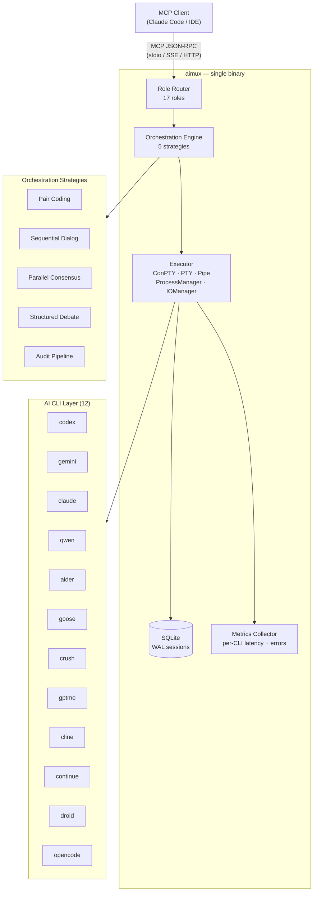

🌐 [English](README.md) | **Русский**

[](https://go.dev)
[](LICENSE)
[](test/)
[](https://goreportcard.com/report/github.com/thebtf/aimux)
[](https://modelcontextprotocol.io)
[](config/cli.d/)

# aimux

**Один MCP-сервер. 12 AI-инструментов для разработки. Ноль переключений контекста.**

---

## Проблема

У вас есть Codex для генерации кода, Claude для рассуждений, Gemini для анализа, Aider для правки файлов на лету. Каждый живёт в отдельном терминале со своими флагами, форматом вывода и состоянием сессии. Переключение между ними означает копирование промптов, потерю контекста и ручное управление десятком процессов.

## Решение

aimux — это единый бинарный MCP-сервер, который предоставляет доступ ко всем 12 CLI через один унифицированный интерфейс. Ваш редактор делает один JSON-RPC вызов. aimux направляет его к нужному инструменту, оркестрирует многомодельные пайплайны, нормализует вывод и сохраняет сессии в SQLite — всё через stdio-транспорт, который уже понимает каждый MCP-клиент.

## Почему лучше

Один бинарь, ноль зависимостей от внешних рантаймов, 777 теста, 3 транспорта. Маршрутизация по ролям направляет промпты `codereview` к модели, заточенной под код-ревью, промпты `debug` — к модели, лучшей в трассировке, а `secaudit` — к модели, обученной на паттернах уязвимостей, без необходимости указывать имя CLI. Пять стратегий оркестрации позволяют нескольким моделям дискутировать, аудировать код или писать его в паре. Результат поставляется как статический Go-бинарь: собрал один раз — копируй куда угодно.

---

## Архитектура



---

## Быстрый старт

**Шаг 1 — Установка**

```bash
go install github.com/thebtf/aimux/cmd/aimux@latest
```

**Шаг 2 — Подключение к Claude Code**

Добавьте в `~/.claude.json` (или в конфиг вашего MCP-клиента):

```json
{
  "mcpServers": {
    "aimux": {
      "command": "aimux",
      "args": []
    }
  }
}
```

**Шаг 3 — Проверка**

```bash
echo '{"jsonrpc":"2.0","id":1,"method":"tools/list","params":{}}' | aimux
```

В ответе вы должны увидеть все 11 инструментов. aimux автоматически определяет, какие CLI установлены в `$PATH` — активными становятся только найденные.

---

## Возможности

### Маршрутизация и выполнение

- **Маршрутизация по роли, а не по имени** — 17 семантических ролей (`coding`, `codereview`, `debug`, `secaudit`, `analyze`, `refactor`, `testgen`, `planner`, `thinkdeep`, ...) каждая сопоставляется с лучшим CLI, моделью и усилием рассуждения для данной задачи
- **Прямой вызов любого CLI** — обходите маршрутизацию и вызывайте любой из 12 CLI по имени с полным контролем над моделью, флагами и сессией
- **Асинхронный запуск, опрос по ID** — запускайте долгие задачи в фоне, опрашивайте `status` по готовности, не блокируя редактор
- **Сохранение сессий между перезапусками** — хранилище сессий на базе SQLite с WAL-восстановлением; возобновляйте сессию Codex по ID
- **Circuit breaker для каждого CLI** — 3 последовательных сбоя открывают цепь; период восстановления предотвращает каскадные отказы

### Стратегии оркестрации

- **Pair coding** — ведущий CLI пишет код, проверяющий CLI критикует каждый раунд; настраиваемое количество раундов и ролей
- **Sequential dialog** — два CLI поочерёдно отвечают до N ходов; полезен для итеративного уточнения
- **Parallel consensus** — все участвующие CLI получают один и тот же промпт независимо (вслепую); опционально синтезируются в один авторитетный ответ
- **Structured debate** — один CLI аргументирует «за», другой «против», фиксированное количество ходов; опциональный синтез выносит вердикт
- **Audit pipeline** — параллельные сканеры собирают находки, валидатор перепроверяет ложноположительные срабатывания, исследователь углубляется в подтверждённые проблемы; структурированный отчёт на выходе

### Рассуждение и исследование

- **17 паттернов мышления** — chain-of-thought, tree-of-thought, «адвокат дьявола», SWOT, pre-mortem, научный метод, первые принципы и ещё 10; запускаются отдельно или в многомодельном консенсусе
- **Конвергентное расследование** — итеративное углублённое исследование с 5-уровневой оценкой уверенности, отслеживанием конвергенции, накоплением находок и вспоминанием из предыдущих запусков
- **Глубокое исследование** — делегирует Google Gemini API для многошагового обоснованного поиска с указанием источников

### Качество и надёжность

- **Хуки до/после** — запускайте скрипты или команды до и после каждого выполнения CLI с защитой по таймауту
- **Валидатор ходов** — перехватывает пустой вывод, ответы с превышением лимита запросов и отказы до того, как они дойдут до клиента
- **Quality gate** — логика повтора, эскалации или остановки для каждого участника не даёт многоходовой оркестрации деградировать
- **17 ролевых промптов** — составные системные промпты, загружаемые из `config/prompts.d/` для каждой роли

### Наблюдаемость

- **Метрики по каждому CLI** — количество запросов, перцентили задержки и частота ошибок, доступные через `aimux://metrics`
- **Health-ресурс** — `aimux://health` возвращает аптайм сервера, активные задачи и состояния circuit breaker
- **3 транспорта** — stdio (по умолчанию, без настройки), SSE и StreamableHTTP для сетевых клиентов

---

## Поддерживаемые CLI

| CLI | Бинарь | Стиль промпта | Формат вывода | Примечания |
|-----|--------|--------------|---------------|-----------|
| codex | `codex` | positional | JSONL | Возобновление сессии, флаги усилия рассуждения |
| gemini | `gemini` | флаг `-p` | JSON | Глубокое исследование через Gemini API |
| claude | `claude` | positional / `-p` headless | JSON | |
| qwen | `qwen` | флаг `-p` | JSON | |
| aider | `aider` | флаг `--message` | text | Правка файлов на лету |
| goose | `goose` | флаг `-t` | JSON | Подкоманда `goose run` |
| crush | `crush` | positional | text | Подкоманда `crush run` |
| gptme | `gptme` | positional | text | |
| cline | `cline` | positional | text | Подкоманда `cline task` |
| continue | `cn` | positional / `-p` headless | JSON | |
| droid | `droid` | positional | JSON | Подкоманда `droid exec` |
| opencode | `opencode` | positional | JSON | Подкоманда `opencode run` |

aimux автоматически определяет установленные CLI при запуске через проверку наличия бинарей. Неустановленные CLI пропускаются — сервер стартует с тем, что доступно.

---

## Справочник MCP-инструментов

| Инструмент | Что делает | Ключевые параметры |
|-----------|-----------|-------------------|
| `exec` | Выполняет промпт через любой CLI с маршрутизацией по роли | `prompt`, `cli`, `role`, `model`, `async`, `session_id` |
| `status` | Проверяет статус асинхронной задачи и получает вывод | `job_id` |
| `sessions` | Управляет жизненным циклом сессий: list, info, cancel, kill, gc, health | `action`, `session_id` |
| `consensus` | Параллельные независимые мнения от нескольких CLI с опциональным синтезом | `prompt`, `clis`, `blinded`, `synthesize` |
| `dialog` | Последовательное многоходовое обсуждение между двумя CLI | `prompt`, `cli_a`, `cli_b`, `max_turns` |
| `debate` | Состязательная структурированная дискуссия с вердиктом | `topic`, `pro_cli`, `con_cli`, `synthesize` |
| `audit` | Многоагентный аудит кодовой базы: scan → validate → investigate | `path`, `mode`, `focus` |
| `deepresearch` | Глубокое исследование через Google Gemini с вложениями и кешированием | `topic`, `output_format`, `model`, `force` |
| `think` | 17 структурированных паттернов рассуждения, одиночных или многомодельных | `prompt`, `pattern`, `clis`, `consensus` |
| `investigate` | Глубокое расследование с отслеживанием конвергенции и вспоминанием | `question`, `domain`, `max_iterations` |
| `agents` | Обнаружение и вызов агентов проекта из реестра | `action`, `agent_id`, `prompt` |

### MCP-ресурсы

| URI | Содержимое |
|-----|-----------|
| `aimux://health` | Здоровье сервера, активные задачи, состояния circuit breaker |
| `aimux://metrics` | Количество запросов, задержка, частота ошибок по каждому CLI |

### MCP-промпты

| Промпт | Назначение |
|--------|-----------|
| `background` | Шаблон для отправки промптов фоновых задач |

---

## Примеры использования

### Маршрутизация по роли (рекомендуется)

```json
{
  "method": "tools/call",
  "params": {
    "name": "exec",
    "arguments": {
      "prompt": "Refactor this function to use early returns",
      "role": "refactor"
    }
  }
}
```

aimux разрешает `refactor` в настроенный CLI и модель — указывать CLI явно не нужно.

### Асинхронный запуск с опросом позже

```json
{
  "method": "tools/call",
  "params": {
    "name": "exec",
    "arguments": {
      "prompt": "Audit all authentication code for OWASP Top 10 issues",
      "role": "secaudit",
      "async": true
    }
  }
}
```

```json
{
  "method": "tools/call",
  "params": {
    "name": "status",
    "arguments": { "job_id": "job_01HXYZ..." }
  }
}
```

### Многомодельный консенсус

```json
{
  "method": "tools/call",
  "params": {
    "name": "consensus",
    "arguments": {
      "prompt": "What is the best approach for distributed rate limiting?",
      "clis": ["codex", "gemini", "claude"],
      "blinded": true,
      "synthesize": true
    }
  }
}
```

### Состязательная дискуссия

```json
{
  "method": "tools/call",
  "params": {
    "name": "debate",
    "arguments": {
      "topic": "Should this service use event sourcing or CRUD?",
      "pro_cli": "codex",
      "con_cli": "gemini",
      "synthesize": true
    }
  }
}
```

### Структурированное рассуждение

```json
{
  "method": "tools/call",
  "params": {
    "name": "think",
    "arguments": {
      "prompt": "Should we migrate this monolith to microservices?",
      "pattern": "premortem",
      "clis": ["codex", "gemini"],
      "consensus": true
    }
  }
}
```

---

## Конфигурация

### Конфигурация сервера (`config/default.yaml`)

aimux ищет конфиг в `AIMUX_CONFIG_DIR` (переменная окружения) или в `./config/` рядом с бинарём. Переопределения для конкретного проекта помещаются в `{cwd}/.aimux/config.yaml`.

```yaml
server:
  log_level: info                      # debug | info | warn | error
  log_file: ~/.config/aimux/aimux.log
  db_path: ~/.config/aimux/sessions.db
  max_concurrent_jobs: 10
  session_ttl_hours: 24
  default_timeout_seconds: 300

  transport:
    type: stdio                        # stdio | sse | http
    port: :8080                        # используется транспортами sse и http
```

### Маршрутизация по ролям (`config/default.yaml`)

```yaml
roles:
  coding:
    cli: codex
    model: gpt-5.4
  codereview:
    cli: codex
    model: gpt-5.4
    reasoning_effort: high
  analyze:
    cli: gemini
  thinkdeep:
    cli: codex
    model: gpt-5.4
    reasoning_effort: high
  default:
    cli: codex
```

Переопределение любой роли в рантайме (формат `CLI:MODEL:EFFORT`):

```bash
AIMUX_ROLE_CODING=gemini:gemini-2.5-pro:high aimux
```

### Профили CLI (`config/cli.d/{name}/profile.yaml`)

Каждый CLI описывается профилем, который точно указывает aimux, как его вызывать:

```yaml
name: codex
binary: codex
command:
  base: "codex exec"
prompt_flag_type: positional
output_format: jsonl
stdin_threshold: 6000          # pipe via stdin above this char count
completion_pattern: "turn\\.completed"
headless_flags: ["--full-auto"]
```

### Circuit breaker

```yaml
circuit_breaker:
  failure_threshold: 3         # последовательных сбоев до открытия цепи
  cooldown_seconds: 300
  half_open_max_calls: 1
```

### Выбор транспорта

```bash
# SSE транспорт (сетевые клиенты)
MCP_TRANSPORT=sse PORT=:8080 aimux

# StreamableHTTP транспорт
MCP_TRANSPORT=http PORT=:8080 aimux
```

Оба сетевых транспорта по умолчанию привязываются к localhost.

---

## Установка

### Требования

- Go 1.25+ — `go version`
- Хотя бы один поддерживаемый CLI, установленный в `$PATH` (например, `codex`, `claude`, `gemini`)

### go install (рекомендуется)

```bash
go install github.com/thebtf/aimux/cmd/aimux@latest
```

### Сборка из исходников

```bash
git clone https://github.com/thebtf/aimux.git
cd aimux
go build -o aimux ./cmd/aimux/
# Скопируйте бинарь в любое место из $PATH
```

### Docker

```bash
# Сборка
docker build -t aimux .

# Запуск с stdio-транспортом (pipe через docker)
docker run -i aimux

# Запуск с SSE-транспортом
docker run -p 8080:8080 -e MCP_TRANSPORT=sse aimux
```

Docker-образ автоматически копирует `config/` в `/etc/aimux/config`.

### Проверка установки

```bash
echo '{"jsonrpc":"2.0","id":1,"method":"resources/list","params":{}}' | aimux
# Ожидаемый результат: { "result": { "resources": [{ "uri": "aimux://health", ... }] } }
```

---

## Разработка

```bash
# Собрать всё
go build ./...

# Запустить все 777 теста (~75 сек на Windows)
go test ./... -timeout 300s

# Юнит-тесты с покрытием
go test ./pkg/... -cover

# Только E2E-тесты (реальный MCP-протокол через stdio)
go test ./test/e2e/ -v

# Статический анализ
go vet ./...
```

### Структура проекта

```
cmd/aimux/           точка входа — выбор транспорта и запуск сервера
cmd/testcli/         10 эмуляторов CLI для e2e-тестов
pkg/server/          MCP-обработчики для всех 11 инструментов, ресурсов и промптов
pkg/orchestrator/    5 стратегий + управление контекстом + quality gate
pkg/executor/        ConPTY / PTY / Pipe процесс-экзекуторы
pkg/think/           17 паттернов рассуждения
pkg/investigate/     система конвергентного расследования
pkg/hooks/           хуки до/после выполнения с защитой по таймауту
pkg/metrics/         потокобезопасный сборщик метрик по CLI
pkg/session/         SQLite-персистентность с WAL и GC
pkg/config/          загрузчик YAML-конфига + профили CLI
pkg/driver/          определение бинарей CLI и реестр
pkg/resolve/         разрешение команд с учётом профилей
pkg/routing/         маршрутизация CLI по ролям
pkg/prompt/          движок промптов с рекурсивной загрузкой директорий
pkg/parser/          нормализатор вывода JSONL / JSON / text
config/cli.d/        один profile.yaml на каждый CLI
config/prompts.d/    составные шаблоны ролевых промптов
```

### Статистика

- 13 314 строк реализации + 8 725 строк тестов = **22 039 итого**
- **777 теста**, 0 падений
- **26 пакетов**, ~73% взвешенное покрытие

---

## Участие в разработке

Смотрите [CONTRIBUTING.md](CONTRIBUTING.md) — руководство по участию, стиль кода и чеклист для пулл-реквестов.

---

## Лицензия

MIT — см. [LICENSE](LICENSE).