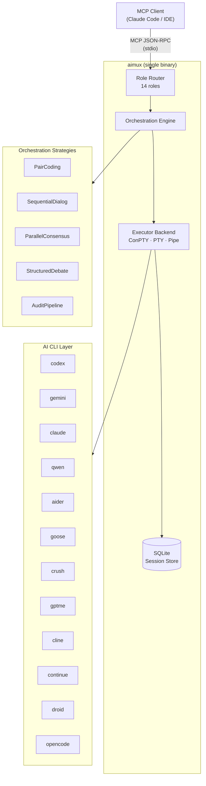

🌐 [English](README.md) | **Русский**

[](https://github.com/thebtf/aimux/actions) [](https://github.com/thebtf/aimux/releases) [](https://go.dev) [](LICENSE) [](https://modelcontextprotocol.io) [](config/cli.d/)

# aimux

**Один MCP-сервер. Все AI-инструменты для разработки. Никакого переключения контекста.**

Современная AI-разработка требует жонглировать десятком инструментов — Codex для генерации, Claude для ревью, Gemini для анализа, Aider для inline-правок. aimux — это MCP-мультиплексор, который автоматически направляет запросы к нужному инструменту, оркестрирует многомодельные рабочие процессы и сохраняет сессии между перезапусками — всё через единый stdio-транспорт, с которым уже умеет работать ваш редактор. Хватит управлять CLI. Пора шипать.

## Архитектура



## Что нового в v3

- **Переписан на Go** — один статический бинарник без Node runtime, Python-окружения и npm. `go build` — и готово к деплою.
- **Profile-aware command resolution** — у каждого CLI есть `profile.yaml`, описывающий точный бинарник, флаги, порог stdin и формат вывода. Никаких захардкоженных `-p prompt`.
- **Конвейер парсеров JSONL/JSON/text** — структурированный вывод всех 12 CLI нормализуется в единый response envelope.
- **12 поддерживаемых CLI** — к исходным 10 добавлены Droid и OpenCode.
- **306 тестов, 62 e2e** — реальные MCP round-trip по stdio; mutation testing через gremlins с порогом 75%.
- **ConPTY executor** — полноценная PTY-эмуляция на Windows без WSL для CLI, требующих терминал.

## Возможности

**Оркестрирует многомодельные рабочие процессы** — стратегии PairCoding, SequentialDialog, ParallelConsensus, StructuredDebate и AuditPipeline компонуют CLI в конвейеры, недоступные ни одному инструменту в одиночку.

**Маршрутизация по роли** — 14 семантических ролей (`coding`, `codereview`, `thinkdeep`, `secaudit`, `debug`, `planner`, `analyze`, `refactor`, `testgen`, `docgen`, `tracer`, `precommit`, `challenge`, `default`), каждая привязана к наиболее подходящему CLI. Настраивается в `default.yaml`.

**Сохраняет сессии** — хранилище на SQLite переживает перезапуски. Возобновите сессию Codex по ID, отмените зависший job или вычистите устаревшие сессии — всё через инструмент `sessions`.

**Асинхронное выполнение** — запустите долгий job, опрашивайте `status`, забирайте результат когда готово. Circuit breaker на каждый CLI предотвращает каскадные сбои.

**Парсит любой формат вывода** — JSONL (Codex), JSON (Claude, Gemini, Goose, Continue, Droid, OpenCode) и plain text (Aider, Crush, GPTMe, Cline) нормализуются перед отдачей клиенту.

**Deep research** — `deepresearch` делегирует запросы Google Gemini API для многоэтапного исследования с указанием источников.

**Структурированное мышление** — `think` предоставляет 17 паттернов рассуждения (chain-of-thought, tree-of-thought, devil's advocate, SWOT, pre-mortem и др.) — как в одиночном режиме, так и в многомодельном консенсусе.

**Обнаружение агентов** — `agents` запрашивает реестр Loom Agents и может вызывать их напрямую.

## Быстрый старт

**Шаг 1 — Сборка**

```bash
go build -o aimux ./cmd/aimux/
```

**Шаг 2 — Добавить в Claude Code**

```json
{
  "mcpServers": {
    "aimux": {
      "command": "/path/to/aimux",
      "args": [],
      "env": {}
    }
  }
}
```

**Шаг 3 — Проверить**

```bash
echo '{"jsonrpc":"2.0","id":1,"method":"tools/list","params":{}}' | ./aimux
```

В ответе должны быть перечислены все 11 инструментов.

## Установка

### Требования

- Go 1.25+ (`go version`)
- Хотя бы один из поддерживаемых AI CLI, установленный и доступный в `$PATH` (например, `codex`, `claude`, `gemini`)

### Из исходников (go install)

```bash
go install github.com/thebtf/aimux/cmd/aimux@latest
```

### Сборка из исходников

```bash
git clone https://github.com/thebtf/aimux.git
cd aimux
go build -o aimux ./cmd/aimux/
# Бинарник находится в ./aimux — переместите в любое место на $PATH
```

### Docker

```bash
# Сборка
docker build -t aimux .

# Запуск (stdio transport — проброс через docker)
docker run -i aimux
```

Docker-образ копирует `config/` в `/etc/aimux/config` и автоматически устанавливает `AIMUX_CONFIG_DIR=/etc/aimux/config`.

### Проверка

```bash
echo '{"jsonrpc":"2.0","id":1,"method":"resources/list","params":{}}' | ./aimux
# Ожидается: { "result": { "resources": [{ "uri": "aimux://health", ... }] } }
```

## Конфигурация

### Конфигурация сервера (`config/default.yaml`)

Файл конфигурации ищется в `AIMUX_CONFIG_DIR` (переменная окружения) или в `./config/` рядом с бинарником. Переопределения для конкретного проекта — в `{cwd}/.aimux/config.yaml`.

```yaml
server:
  log_level: info                    # debug | info | warn | error
  log_file: ~/.config/aimux/aimux.log
  db_path: ~/.config/aimux/sessions.db
  max_concurrent_jobs: 10            # глобальный лимит параллельных jobs
  session_ttl_hours: 24              # сессии старше этого значения удаляются GC
  gc_interval_seconds: 300           # как часто запускается GC
  progress_interval_seconds: 15      # интервал heartbeat для async jobs
  default_async: false               # запускать все jobs асинхронно по умолчанию
  default_timeout_seconds: 300       # таймаут на job

  audit:
    scanner_role: codereview
    validator_role: analyze
    default_mode: standard           # standard | deep | quick
    parallel_scanners: 3
    scanner_timeout_seconds: 600
    validator_timeout_seconds: 300

  pair:
    driver_role: coding
    reviewer_role: codereview
    max_rounds: 3
    driver_timeout_seconds: 300
    reviewer_timeout_seconds: 180

  consensus:
    default_blinded: true            # модели не видят ответы друг друга
    default_synthesize: false        # выполнять проход синтеза после консенсуса
    max_turns: 8
    timeout_per_turn_seconds: 180

  debate:
    default_synthesize: true
    max_turns: 6
    timeout_per_turn_seconds: 180

  research:
    default_synthesize: true
    timeout_per_participant_seconds: 300

  think:
    auto_consensus_threshold: 60     # количество токенов, выше которого запускается консенсус
    default_dialog_max_turns: 4
```

### CLI-профили (`config/cli.d/{name}/profile.yaml`)

Каждый CLI описывается профилем, который сообщает aimux, как именно его вызывать:

```yaml
name: codex
binary: codex
display_name: "Codex (OpenAI)"

features:
  streaming: true
  headless: true
  read_only: true
  session_resume: true
  jsonl: true
  stdin_pipe: true

output_format: jsonl

command:
  base: "codex exec"

# Как передаётся prompt:
#   positional — добавляется последним аргументом (codex, claude, crush, gptme, cline, continue, droid, opencode)
#   flag       — через именованный флаг (gemini: -p, aider: --message, goose: -t, qwen: -p)
prompt_flag: ""
prompt_flag_type: "positional"

model_flag: "-m"
default_model: ""

reasoning:
  flag: "-c"
  flag_value_template: 'model_reasoning_effort="{{.Level}}"'
  levels: [low, medium, high, xhigh]

timeout_seconds: 3600
stdin_threshold: 6000              # передавать через stdin выше этого порога символов
completion_pattern: "turn\\.completed"

headless_flags: ["--full-auto"]
read_only_flags: ["--sandbox", "read-only"]
```

### Маршрутизация по ролям

В `config/default.yaml` каждой роли сопоставляется CLI, модель и уровень reasoning effort:

```yaml
roles:
  coding:
    cli: codex
    model: gpt-5.3-codex
  codereview:
    cli: codex
    model: gpt-5.4
    reasoning_effort: high
  analyze:
    cli: gemini
  thinkdeep:
    cli: codex
    model: gpt-5.4
    reasoning_effort: high
  default:
    cli: codex
```

Любую роль можно переопределить в runtime через переменные окружения `AIMUX_ROLE_{ROLE}_CLI` и `AIMUX_ROLE_{ROLE}_MODEL`.

### Circuit breaker

```yaml
circuit_breaker:
  failure_threshold: 3        # количество последовательных сбоев до размыкания цепи
  cooldown_seconds: 300       # как долго цепь остаётся разомкнутой
  half_open_max_calls: 1      # пробные вызовы в состоянии half-open
```

## Поддерживаемые CLI

| Name | Binary | Command | Prompt flag | Output format |
|------|--------|---------|-------------|---------------|
| codex | `codex` | `codex exec` | positional | jsonl |
| gemini | `gemini` | `gemini` | `-p` | json |
| claude | `claude` | `claude` | positional (`-p` = headless) | json |
| qwen | `qwen` | `qwen` | `-p` | json |
| aider | `aider` | `aider` | `--message` | text |
| goose | `goose` | `goose run` | `-t` | json |
| crush | `crush` | `crush run` | positional | text |
| gptme | `gptme` | `gptme` | positional | text |
| cline | `cline` | `cline task` | positional | text |
| continue | `cn` | `cn` | positional (`-p` = headless) | json |
| droid | `droid` | `droid exec` | positional | json |
| opencode | `opencode` | `opencode run` | positional | json |

## Справочник по MCP-инструментам

| Tool | Описание | Основные параметры |
|------|----------|--------------------|
| `exec` | Выполнить prompt через любой CLI с маршрутизацией по роли | `prompt`, `cli`, `role`, `model`, `async`, `session_id` |
| `status` | Проверить статус async job и получить вывод | `job_id` |
| `sessions` | Управление сессиями: list, info, cancel, kill, gc, health | `action`, `session_id` |
| `consensus` | Многомодельный blinded-консенсус с опциональным синтезом | `prompt`, `clis`, `blinded`, `synthesize` |
| `dialog` | Последовательный многоходовой диалог между двумя CLI | `prompt`, `cli_a`, `cli_b`, `max_turns` |
| `debate` | Структурированные дебаты с вынесением вердикта | `topic`, `pro_cli`, `con_cli`, `synthesize` |
| `audit` | Многоагентный аудит кодовой базы: scan → validate → investigate | `path`, `mode`, `focus` |
| `think` | 17 паттернов структурированного мышления (solo или multi-model) | `prompt`, `pattern`, `clis`, `consensus` |
| `investigate` | Итеративное конвергентное расследование со специализацией по домену | `question`, `domain`, `max_iterations` |
| `agents` | Обнаружение и запуск Loom Agents из реестра | `action`, `agent_id`, `prompt` |
| `deepresearch` | Глубокое исследование через Google Gemini API с указанием источников | `query`, `depth`, `synthesize` |

## Примеры использования

### Выполнение prompt с маршрутизацией по роли

```json
{
  "jsonrpc": "2.0",
  "id": 1,
  "method": "tools/call",
  "params": {
    "name": "exec",
    "arguments": {
      "prompt": "Refactor this function to use early returns",
      "role": "refactor"
    }
  }
}
```

### Запуск async job и опрос результатов

```json
{
  "jsonrpc": "2.0",
  "id": 2,
  "method": "tools/call",
  "params": {
    "name": "exec",
    "arguments": {
      "prompt": "Audit all authentication code for OWASP Top 10 issues",
      "role": "secaudit",
      "async": true
    }
  }
}
```

```json
{
  "jsonrpc": "2.0",
  "id": 3,
  "method": "tools/call",
  "params": {
    "name": "status",
    "arguments": {
      "job_id": "job_01HXYZ..."
    }
  }
}
```

### Многомодельный консенсус

```json
{
  "jsonrpc": "2.0",
  "id": 4,
  "method": "tools/call",
  "params": {
    "name": "consensus",
    "arguments": {
      "prompt": "What is the best approach for distributed rate limiting?",
      "clis": ["codex", "gemini", "claude"],
      "blinded": true,
      "synthesize": true
    }
  }
}
```

### Структурированные дебаты

```json
{
  "jsonrpc": "2.0",
  "id": 5,
  "method": "tools/call",
  "params": {
    "name": "debate",
    "arguments": {
      "topic": "Should this service use event sourcing or CRUD?",
      "pro_cli": "codex",
      "con_cli": "gemini",
      "synthesize": true
    }
  }
}
```

## Стратегии оркестрации

**PairCoding** — driver CLI пишет реализацию, reviewer CLI критикует каждый раунд. Настраиваются количество раундов, роли driver/reviewer и таймауты. Финальный вывод содержит аннотированный diff.

**SequentialDialog** — два CLI по очереди отвечают на вывод друг друга до `max_turns` обменов. Полезно для итеративного улучшения, где важно чередование точек зрения.

**ParallelConsensus** — все участвующие CLI независимо получают один и тот же prompt (по умолчанию в режиме blinded). Их ответы сравниваются и по желанию синтезируются координатором в единый авторитетный ответ.

**StructuredDebate** — один CLI отстаивает позицию «за», другой — «против», фиксированное число ходов. Опциональный проход синтеза выносит вердикт, взвешивая оба аргумента.

**AuditPipeline** — трёхфазный конвейер: параллельные сканеры (роль `scanner_role`) формируют список находок, валидатор (роль `validator_role`) перепроверяет их на ложные срабатывания, инвестигатор углубляется в подтверждённые проблемы. Результаты объединяются в структурированный отчёт аудита.

## Разработка

```bash
# Собрать всё
go build ./...

# Запустить все тесты (306 тестов, ~75с на Windows)
go test ./... -timeout 300s

# Юнит-тесты с покрытием
go test ./pkg/... -cover

# Только e2e тесты (62 теста, реальный MCP-протокол по stdio)
go test ./test/e2e/ -v

# PTY-тесты через WSL (Linux/Mac или WSL на Windows)
go test ./pkg/executor/ -v -tags pty

# Статический анализ
go vet ./...

# Сборка эмуляторов testcli (используются в e2e-наборе)
go build -o testcli.exe ./cmd/testcli/
```

### Структура проекта

```
cmd/aimux/        — точка входа MCP-сервера (stdio transport)
cmd/testcli/      — 10 CLI-эмуляторов для e2e-тестирования
pkg/server/       — обработчики MCP-инструментов (exec, status, sessions, dialog и др.)
pkg/orchestrator/ — стратегии для нескольких CLI (consensus, debate, dialog, pair, audit)
pkg/executor/     — исполнители процессов (ConPTY, PTY, Pipe)
pkg/driver/       — загрузка CLI-профилей и реестр
pkg/config/       — YAML-конфигурация
pkg/session/      — хранение сессий/jobs в SQLite
pkg/parser/       — парсеры вывода JSONL/JSON/text
pkg/types/        — общие интерфейсы и типы
config/cli.d/     — CLI-профили (отдельная директория на каждый CLI)
config/prompts.d/ — компонуемые шаблоны промптов
```

### CI

- **ci.yml** — сборка и тесты при каждом push и PR
- **mutation.yml** — еженедельное mutation testing через gremlins, требуемый порог kill rate — 75%

## Участие в разработке

Руководство по участию, стиль кода и чеклист для PR — в [CONTRIBUTING.md](CONTRIBUTING.md).

## Лицензия

MIT — см. [LICENSE](LICENSE).
